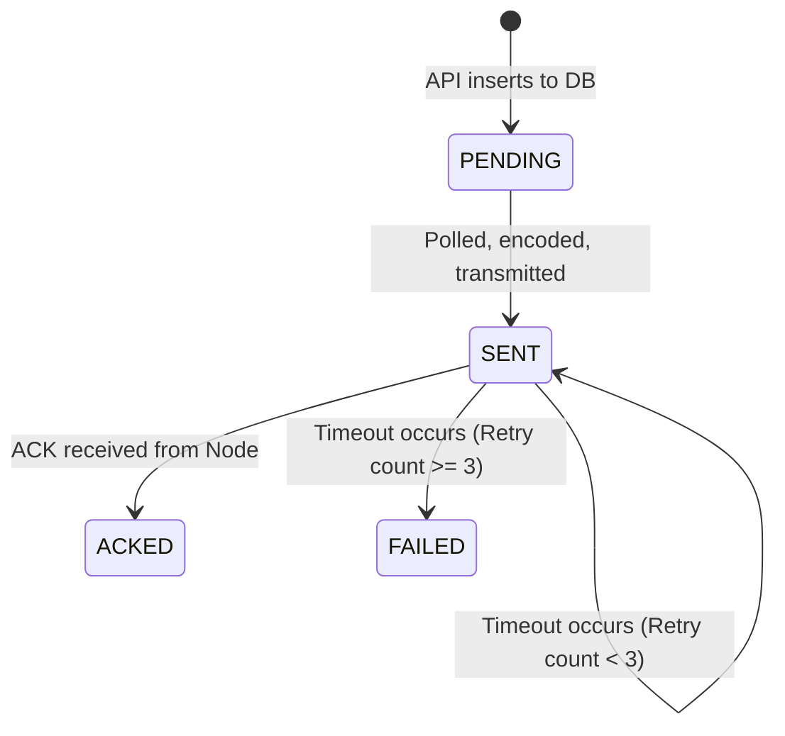

# Phase 2C Walkthrough: Gateway Service

The Orchard Brain Gateway Service has been successfully implemented, bridging the Phase 2B API queued database commands with the Phase 1C LoRa radio payload formatters.

## One-in-flight-per-node enforcement
To prevent collision and out-of-order execution, the Gateway Service strictly enforces a one-in-flight-per-node concurrency model. 
When the `_poll_loop` queries the `PENDING` queue, it checks the target node ID against an `inflight` dictionary. If that node already has an active command pending an ACK, the new command is skipped during this polling cycle. It will only be transmitted once the previous command is either `ACKED` or `FAILED`.

## GatewayService state machine
The lifecycle of a dispatched command rigidly follows this state machine:


## ACK correlation implementation
When a packet is received, the `TransportInterface` invokes the `_on_receive` callback. The `LoRaDecoder` parses the frame.
Because Actuation Commands lack a generic sequence number, Phase 2C leverages the one-in-flight restriction for correlation. When a `PKT_TYPE_DATA_ACK` is received:
1. The gateway extracts the Source Node ID directly from the MAC header.
2. It looks up that Node ID in the `inflight` dictionary.
3. The command is popped from the dictionary, and the database status is safely updated to `ACKED`.

## Timeout implementation
A dedicated asynchronous `_timeout_loop()` continually scans the `inflight` dictionary every 1 second.
If the gateway detects that `now - sent_time > 5.0s` (the defined timeout window), a timeout exception is triggered for that specific node's command, resulting in a retry or a failure.

## Retry implementation
When a timeout occurs, the retry policy is evaluated:
- If the current `retries` count is less than `3` (the `max_retries` threshold):
  - The retry counter is incremented.
  - The `sent_time` is reset to `now`.
  - The exact same binary frame is re-transmitted via `TransportInterface.send_bytes()`.
- If the `retries` count equals `3`:
  - The command is dropped from the `inflight` dictionary.
  - The database record is permanently transitioned to `FAILED`.

## Final test results
Integration tests (`gateway/tests/test_service.py`) construct a local in-memory SQLite database alongside a fully simulated `MockTransport` to verify the state machine and encoding.

All gateway tests pass successfully.

```text
============================= test session starts =============================
platform win32 -- Python 3.10.11, pytest-9.1.0, pluggy-1.6.0
rootdir: C:\Users\zonob\orchard-brain-core
configfile: pyproject.toml
plugins: anyio-4.13.0, langsmith-0.8.3, asyncio-1.4.0
asyncio: mode=strict, debug=False, asyncio_default_fixture_loop_scope=None, asyncio_default_test_loop_scope=function
collected 1 item

gateway\tests\test_service.py .                                          [100%]

============================== 1 passed in 0.91s ==============================
```
