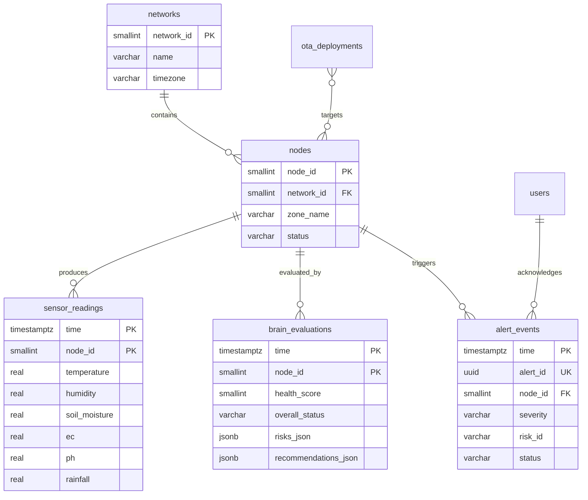
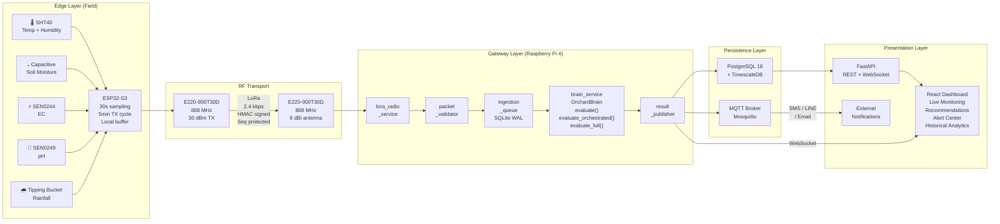
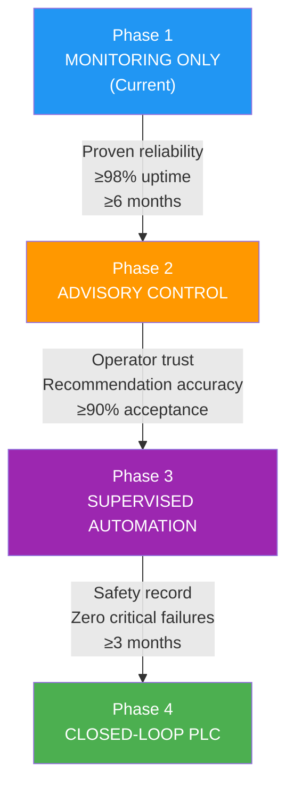

# Orchard Brain — Phase 1 System Architecture

**Document Revision:** 1.0  
**Date:** 2026-06-15  
**Classification:** Engineering Design Document  
**Scope:** Full-system architecture for Phase 1 deployment of Smart Durian Orchard monitoring infrastructure.

---

> [!IMPORTANT]
> **Governing Constraint:** The existing `orchard_brain` intelligence core (located at `src/orchard_brain/`) is a protected black-box domain engine. Phase 1 infrastructure wraps, feeds, and consumes this engine. No modifications to existing intelligence logic are permitted. All integration occurs through the published `OrchardBrain` facade and its three entry points: `evaluate()`, `evaluate_orchestrated()`, and `evaluate_full()`.

---

## Table of Contents

1. [ESP32 Edge Node Architecture](#1-esp32-edge-node-architecture)
2. [LoRa E220 Network Architecture](#2-lora-e220-network-architecture)
3. [Gateway Architecture](#3-gateway-architecture)
4. [Canonical Payload Schema](#4-canonical-payload-schema)
5. [Database Architecture](#5-database-architecture)
6. [Dashboard Architecture](#6-dashboard-architecture)
7. [Security Architecture](#7-security-architecture)
8. [Deployment Topology](#8-deployment-topology)
9. [PLC Migration Strategy](#9-plc-migration-strategy)
10. [Repository Structure](#10-repository-structure)

---

## 1. ESP32 Edge Node Architecture

### 1.1 Hardware Platform

| Component | Selection | Rationale |
|---|---|---|
| MCU | ESP32-S3-WROOM-1 (N16R8) | 16 MB flash (OTA dual-partition), 8 MB PSRAM (payload buffering), dual-core 240 MHz, hardware crypto (AES-256), deep-sleep 10 µA |
| LoRa Module | EBYTE E220-900T30D | UART-attached, 868/915 MHz, 30 dBm TX, 10 km line-of-sight, built-in RSSI reporting |
| Power | 12 V solar panel (20 W) + 18650 Li-ion (3.7 V, 3400 mAh × 2) + TP4056 charge controller + MT3608 boost to 5 V | 72-hour autonomy without sun at 30-second sampling intervals |

### 1.2 Sensor Abstraction

All sensors are accessed through a unified `SensorPort` abstraction that decouples the firmware from specific sensor hardware. Each sensor channel maps directly to a field required by the Orchard Brain `SensorSnapshot` contract.

#### 1.2.1 Sensor Channel Registry

| Channel ID | Physical Sensor | Interface | Unit | Maps to `SensorSnapshot` Field | Calibration Method |
|---|---|---|---|---|---|
| `TEMP_AIR` | SHT40 | I²C (0x44) | °C | `temperature` | Factory-calibrated; 2-point field verification at 20 °C and 40 °C |
| `HUMIDITY_AIR` | SHT40 | I²C (0x44) | % RH | `humidity` | Factory-calibrated; salt-solution verification (NaCl 75.3 %, MgCl₂ 32.8 %) |
| `SOIL_MOISTURE` | Capacitive v2.0 (corrosion-free) | ADC1_CH0 (GPIO 36) | % VWC | `soil_moisture` | 3-point gravimetric calibration per soil type (dry/field-capacity/saturated) |
| `SOIL_EC` | DFRobot SEN0244 | ADC1_CH3 (GPIO 39) | µS/cm | `ec` | 2-point calibration: 84 µS/cm and 1413 µS/cm standard solutions |
| `SOIL_PH` | DFRobot SEN0249 | ADC1_CH6 (GPIO 34) | pH | `ph` | 3-point calibration: pH 4.01, 6.86, 9.18 buffer solutions; recalibrate every 90 days |
| `RAIN_GAUGE` | Tipping-bucket (0.2 mm/tip) | GPIO interrupt (GPIO 27) | mm | `rainfall` | Factory-calibrated; verify against graduated cylinder annually |

#### 1.2.2 Sensor Port Interface

Each sensor driver conforms to the following abstract interface:

```
SensorPort:
    channel_id   : str           — unique identifier from the registry above
    read()       : SensorResult  — returns calibrated value + metadata
    status()     : PortStatus    — ONLINE | DEGRADED | OFFLINE | CALIBRATING
    calibrate()  : void          — enters interactive or automatic calibration mode
    self_test()  : TestResult    — hardware connectivity verification

SensorResult:
    value        : float         — calibrated measurement in registered unit
    raw_adc      : uint16        — raw ADC reading (for diagnostics)
    timestamp    : uint32        — millis() at measurement capture
    quality      : enum          — GOOD | SUSPECT | BAD
    error_code   : uint8         — 0x00 = no error; see Error Table §1.2.4

PortStatus:
    ONLINE       : sensor responding, last reading quality GOOD
    DEGRADED     : sensor responding, but quality SUSPECT (e.g., reading near rail)
    OFFLINE      : sensor not responding after 3 consecutive I²C/ADC failures
    CALIBRATING  : calibration mode active; readings suppressed
```

#### 1.2.3 ADC Conditioning Pipeline

All analog sensor channels pass through a four-stage conditioning pipeline before value emission:

```
Stage 1: Multi-sample acquisition
    Acquire 16 raw ADC samples at 1 ms intervals.

Stage 2: Outlier rejection
    Discard the 2 highest and 2 lowest samples (trimmed mean, 12 remaining).

Stage 3: Averaging
    Compute arithmetic mean of the 12 remaining samples.

Stage 4: Calibration transform
    Apply per-channel polynomial calibration:
        calibrated_value = C0 + C1 × raw_mean + C2 × raw_mean²
    Coefficients C0, C1, C2 stored in NVS partition per channel.
```

#### 1.2.4 Sensor Error Table

| Error Code | Name | Behaviour |
|---|---|---|
| `0x00` | `ERR_NONE` | Normal operation |
| `0x01` | `ERR_I2C_NACK` | I²C device did not acknowledge; mark OFFLINE after 3 consecutive |
| `0x02` | `ERR_ADC_RAIL` | ADC reading at 0 or 4095 (rail); mark quality SUSPECT |
| `0x03` | `ERR_RANGE_LOW` | Calibrated value below physical minimum; mark quality BAD |
| `0x04` | `ERR_RANGE_HIGH` | Calibrated value above physical maximum; mark quality BAD |
| `0x05` | `ERR_TIMEOUT` | Sensor did not respond within 500 ms; retry once, then mark OFFLINE |
| `0x06` | `ERR_CRC` | I²C CRC-8 check failed (SHT40); discard reading, retry |

### 1.3 Sampling Strategy

#### 1.3.1 Dual-Rate Sampling Model

The edge node operates on two independent sampling rates to balance data fidelity against power and bandwidth:

| Rate | Interval | Purpose | Channels |
|---|---|---|---|
| **Fast sample** | 30 seconds | Internal ring buffer accumulation for local averaging | All 6 channels |
| **Transmit cycle** | 5 minutes | LoRa payload generation from aggregated fast samples | Aggregated payload |

At each transmit cycle (every 5 minutes), the node computes from the accumulated fast samples:

```
For each channel:
    tx_value     = median of last 10 fast samples (5 minutes ÷ 30 seconds)
    tx_min       = minimum of last 10 fast samples
    tx_max       = maximum of last 10 fast samples
    tx_quality   = worst quality flag across the 10 samples
```

#### 1.3.2 Adaptive Transmission Escalation

Under abnormal conditions, the transmit cycle shortens to provide faster situational awareness:

| Condition | Trigger | Transmit Interval Override |
|---|---|---|
| Temperature critical | `temperature ≥ 38.0 °C` OR `temperature ≤ 15.0 °C` | 1 minute |
| Soil moisture critical | `soil_moisture ≤ 10.0 %` OR `soil_moisture ≥ 85.0 %` | 1 minute |
| EC critical | `ec ≤ 50 µS/cm` OR `ec ≥ 600 µS/cm` | 2 minutes |
| pH critical | `ph ≤ 4.5` OR `ph ≥ 7.5` | 2 minutes |
| Rapid change | Any channel delta > 20 % within 2 consecutive fast samples | 1 minute (for 3 cycles, then revert) |

Escalation thresholds align exactly with the `_thresholds.py` critical boundaries to ensure the gateway receives data faster precisely when the Orchard Brain will flag critical risks.

#### 1.3.3 Rainfall Accumulation

The rain gauge operates as an interrupt-driven counter. Tips are accumulated across the transmit interval and reset after each transmission:

```
On GPIO interrupt (rising edge, 50 ms debounce):
    rain_tip_count += 1

On transmit cycle:
    rainfall_mm = rain_tip_count × 0.2
    rain_tip_count = 0
```

### 1.4 Local Buffering

#### 1.4.1 Dual-Ring Architecture

The ESP32 maintains two ring buffers in PSRAM:

| Buffer | Capacity | Entry Size | Total Memory | Purpose |
|---|---|---|---|---|
| **Fast buffer** | 120 entries | 32 bytes | 3.8 KB | Last 60 minutes of 30-second raw samples for local aggregation |
| **TX buffer** | 576 entries | 64 bytes | 36 KB | Last 48 hours of 5-minute aggregated payloads for retry on LoRa failure |

#### 1.4.2 TX Buffer Behaviour

```
On transmit cycle:
    1. Aggregate fast buffer → produce TxPayload
    2. Append TxPayload to TX buffer (ring, oldest evicted)
    3. Attempt LoRa transmission
    4. If ACK received:
         Mark TxPayload as DELIVERED
    5. If no ACK:
         Mark TxPayload as PENDING
         TxPayload remains in TX buffer for retry (see §2.4)

On boot / deep-sleep wake:
    Scan TX buffer for PENDING entries.
    Transmit oldest PENDING first (FIFO order).
    Maximum 3 PENDING retransmissions per wake cycle to limit airtime.
```

#### 1.4.3 Persistent Storage (NVS)

The following data survives deep-sleep and power cycles via ESP32 NVS flash:

| Key | Type | Purpose |
|---|---|---|
| `node_id` | `uint16` | Assigned LoRa network address |
| `node_secret` | `uint8[16]` | Pre-shared key for payload signing |
| `seq_num` | `uint32` | Monotonic sequence number (anti-replay) |
| `cal_coeffs_{ch}` | `float[3]` | Per-channel calibration polynomial coefficients |
| `tx_pending_head` | `uint16` | TX buffer PENDING queue head index |
| `last_ota_version` | `uint32` | Currently running firmware version for OTA rollback |
| `boot_count` | `uint32` | Total boot counter (diagnostics) |

### 1.5 Payload Generation

At each transmit cycle, the edge node produces a binary-encoded payload (for LoRa efficiency) that maps 1:1 to the canonical `SensorReading` JSON schema defined in §4.1. The binary encoding is:

```
Offset  Size   Field               Type        Unit
──────  ─────  ──────────────────  ──────────  ─────────
0x00    2      node_id             uint16 LE   —
0x02    4      timestamp           uint32 LE   Unix epoch seconds
0x06    4      sequence_number     uint32 LE   monotonic counter
0x0A    2      temperature × 100   int16 LE    °C × 100
0x0C    2      humidity × 100      uint16 LE   % × 100
0x0E    2      soil_moisture × 100 uint16 LE   % × 100
0x10    2      ec × 10             uint16 LE   µS/cm × 10
0x12    2      ph × 100            uint16 LE   pH × 100
0x14    2      rainfall × 10       uint16 LE   mm × 10
0x16    1      sensor_mask         uint8       bit flags for channel status
0x17    1      battery_pct         uint8       0–100
0x18    1      tx_reason           uint8       0=scheduled, 1=escalation, 2=retry
0x19    1      rssi_last_rx        int8        dBm (last gateway downlink RSSI)
0x1A    4      hmac_truncated      uint8[4]    first 4 bytes of HMAC-SHA256
0x1E    ─      ─                   ─           ─
Total: 30 bytes
```

**`sensor_mask` bit layout:**

| Bit | Channel | Meaning when set (1) |
|---|---|---|
| 0 | `TEMP_AIR` | Channel ONLINE and quality GOOD |
| 1 | `HUMIDITY_AIR` | Channel ONLINE and quality GOOD |
| 2 | `SOIL_MOISTURE` | Channel ONLINE and quality GOOD |
| 3 | `SOIL_EC` | Channel ONLINE and quality GOOD |
| 4 | `SOIL_PH` | Channel ONLINE and quality GOOD |
| 5 | `RAIN_GAUGE` | Channel ONLINE and quality GOOD |
| 6 | Reserved | — |
| 7 | Reserved | — |

### 1.6 OTA Readiness

#### 1.6.1 Partition Layout

```
Flash (16 MB):
┌─────────────────────────────────┐ 0x000000
│ Bootloader (32 KB)              │
├─────────────────────────────────┤ 0x008000
│ Partition Table (4 KB)          │
├─────────────────────────────────┤ 0x009000
│ NVS (24 KB)                     │
├─────────────────────────────────┤ 0x00F000
│ otadata (8 KB)                  │
├─────────────────────────────────┤ 0x010000
│ ota_0 — Application A (4 MB)   │
├─────────────────────────────────┤ 0x410000
│ ota_1 — Application B (4 MB)   │
├─────────────────────────────────┤ 0x810000
│ SPIFFS — Calibration & Config  │
│ (512 KB)                        │
├─────────────────────────────────┤ 0x890000
│ Reserved (remaining flash)      │
└─────────────────────────────────┘
```

#### 1.6.2 OTA Delivery Mechanism

OTA is delivered via the gateway over the LoRa downlink channel using a chunked transfer protocol:

```
OTA Session Flow:

1. Gateway → Node:  OTA_ANNOUNCE { version: uint32, total_size: uint32, chunk_count: uint16, sha256: bytes[32] }
2. Node validates:
     - version > current version (NVS: last_ota_version)
     - total_size ≤ 4 MB (partition size)
     - Node has sufficient battery (> 30 %)
3. Node → Gateway:  OTA_READY { node_id, current_version }
4. For each chunk (512 bytes):
     Gateway → Node:  OTA_CHUNK { chunk_index: uint16, data: bytes[512], crc16: uint16 }
     Node → Gateway:  OTA_CHUNK_ACK { chunk_index } or OTA_CHUNK_NACK { chunk_index }
5. After all chunks received:
     Node verifies SHA-256 of assembled firmware against OTA_ANNOUNCE.sha256
     On match:
         Write to inactive OTA partition (ota_0 or ota_1)
         Set otadata to boot from new partition
         Node → Gateway:  OTA_COMPLETE { node_id, new_version }
         Reboot
     On mismatch:
         Node → Gateway:  OTA_ABORT { node_id, reason: HASH_MISMATCH }
         No reboot. Current firmware preserved.

Rollback:
     If new firmware fails health-check (3 consecutive boot loops within 60 seconds):
         Bootloader reverts otadata to previous partition.
         Node boots previous firmware.
         Node → Gateway:  OTA_ROLLBACK { node_id, reverted_to_version }
```

#### 1.6.3 OTA Scheduling Constraints

| Constraint | Value | Rationale |
|---|---|---|
| Minimum battery for OTA | 30 % | Prevent bricking from power loss mid-write |
| OTA window | 02:00–05:00 local time | Lowest agronomic activity; no data gaps during peak hours |
| Chunk timeout | 10 seconds | Per-chunk ACK deadline before NACK and retry |
| Maximum OTA session duration | 45 minutes | Abort if exceeded (LoRa bandwidth: ~512 bytes/chunk × ~2 sec/chunk) |
| Concurrent OTA nodes | 1 per gateway | Serial delivery to avoid airtime contention |

### 1.7 Firmware State Machine

```
                    ┌───────────┐
         Power-on → │   INIT    │
                    └─────┬─────┘
                          │ Hardware self-test
                          ▼
                    ┌───────────┐     Self-test fail
                    │ SELF_TEST │─────────────────────→ ERROR (blink LED, retry in 60s)
                    └─────┬─────┘
                          │ All sensors ONLINE or DEGRADED
                          ▼
               ┌────────────────────┐
               │   SAMPLING_FAST    │ ← 30-second timer
               │  (acquire sensors) │
               └─────────┬──────────┘
                         │ Every 10th sample (5 min)
                         ▼
               ┌────────────────────┐
               │   TX_AGGREGATE     │
               │ (compute median,   │
               │  build payload,    │
               │  check escalation) │
               └─────────┬──────────┘
                         │
                         ▼
               ┌────────────────────┐
               │   TX_LORA          │
               │ (transmit via E220,│  No ACK after 3 retries
               │  await ACK)        │──────→ Mark PENDING, continue
               └─────────┬──────────┘
                         │ ACK received or PENDING stored
                         ▼
               ┌────────────────────┐
               │   CHECK_OTA        │
               │ (poll for OTA flag │  OTA available
               │  in last downlink) │──────→ OTA_SESSION state
               └─────────┬──────────┘
                         │ No OTA
                         ▼
               ┌────────────────────┐
               │   DEEP_SLEEP       │
               │ (sleep until next  │
               │  30-second sample) │
               └────────────────────┘
```

---

## 2. LoRa E220 Network Architecture

### 2.1 Network Topology

The LoRa network uses a **star topology** with a single gateway at the centre. All edge nodes communicate exclusively with the gateway. Node-to-node communication is not supported in Phase 1.

```
     [Node 001]──╮
     [Node 002]──┤
     [Node 003]──┼──→ [Gateway 0x0000] ──→ Orchard Brain
     [Node ...]──┤
     [Node 064]──╯
```

Maximum deployment: **64 nodes per gateway**, limited by the TDMA scheduling window (§2.3.2).

### 2.2 Node Addressing

#### 2.2.1 Address Space

| Field | Size | Range | Assignment |
|---|---|---|---|
| Network ID | 1 byte | `0x01`–`0xFE` | Identifies the orchard; set during provisioning. `0x00` = reserved (gateway), `0xFF` = broadcast. |
| Node Address | 2 bytes | `0x0001`–`0x00FF` | Unique per node within a network. `0x0000` = gateway. `0xFFFF` = broadcast. |

#### 2.2.2 Address Assignment

Addresses are assigned during physical provisioning using the gateway's serial console or a dedicated provisioning tool. No dynamic address allocation (DHCP-style) is used in Phase 1 to eliminate complexity and ensure deterministic network behaviour.

Provisioning writes the following to the node's NVS:

```
node_id       : uint16   — assigned node address
network_id    : uint8    — orchard network identifier
node_secret   : bytes[16] — unique pre-shared key (generated by gateway)
gateway_addr  : uint16   — always 0x0000
lora_channel  : uint8    — RF channel (0–83, maps to frequency offset)
```

#### 2.2.3 E220 Module Configuration

| Parameter | Value | E220 Register |
|---|---|---|
| UART baud rate | 9600 bps | REG0 |
| Air data rate | 2.4 kbps | REG0 (bits 2–0) |
| TX power | 30 dBm (1 W) | REG1 (bits 1–0) |
| Sub-packet size | 240 bytes | REG0 (bits 7–6) |
| RSSI enable | Yes | REG1 (bit 5) |
| Transmission mode | Fixed (addressed) | REG3 (bit 6) |
| LBT enable | Yes (listen-before-talk) | REG3 (bit 4) |
| WOR mode | Receiver (for downlink wake) | REG3 (bits 2–0) |

### 2.3 Packet Structure

#### 2.3.1 Frame Format

Every LoRa frame follows this structure:

```
┌───────────────────────────────────────────────────────────┐
│                    LoRa PHY Preamble                      │  (handled by E220 hardware)
├───────┬───────┬──────┬────────┬───────────────┬───────────┤
│ DEST  │ SRC   │ NET  │ HDR    │   PAYLOAD     │ HMAC-T    │
│ 2 B   │ 2 B   │ 1 B  │ 1 B   │ 0–200 B       │ 4 B       │
└───────┴───────┴──────┴────────┴───────────────┴───────────┘
```

| Field | Size | Description |
|---|---|---|
| `DEST` | 2 bytes | Destination node address (`0x0000` for uplink to gateway, `0xFFFF` for broadcast) |
| `SRC` | 2 bytes | Source node address |
| `NET` | 1 byte | Network ID |
| `HDR` | 1 byte | Packet type (4 bits) + flags (4 bits); see below |
| `PAYLOAD` | 0–200 bytes | Type-dependent; see §2.3.2 |
| `HMAC-T` | 4 bytes | Truncated HMAC-SHA256 of `[DEST ‖ SRC ‖ NET ‖ HDR ‖ PAYLOAD]` using node_secret |

**Total maximum frame size: 210 bytes** (within E220's 240-byte sub-packet limit with margin).

#### 2.3.2 Packet Types (`HDR` upper nibble)

| Type ID | Name | Direction | Payload Content |
|---|---|---|---|
| `0x1` | `DATA_UPLINK` | Node → Gateway | Binary `SensorReading` (30 bytes, §1.5) |
| `0x2` | `DATA_ACK` | Gateway → Node | `{ seq_num: uint32 }` (4 bytes) |
| `0x3` | `DATA_NACK` | Gateway → Node | `{ seq_num: uint32, reason: uint8 }` (5 bytes) |
| `0x4` | `HEARTBEAT` | Node → Gateway | `{ node_id, uptime_sec, battery_pct, sensor_mask, fw_version }` (12 bytes) |
| `0x5` | `HEARTBEAT_ACK` | Gateway → Node | `{ gateway_time_utc: uint32 }` (4 bytes) — used for clock sync |
| `0x6` | `CONFIG_PUSH` | Gateway → Node | Key-value configuration updates (variable) |
| `0x7` | `CONFIG_ACK` | Node → Gateway | `{ config_hash: uint32 }` (4 bytes) |
| `0x8` | `OTA_ANNOUNCE` | Gateway → Node | See §1.6.2 |
| `0x9` | `OTA_CHUNK` | Gateway → Node | See §1.6.2 |
| `0xA` | `OTA_CHUNK_ACK` | Node → Gateway | See §1.6.2 |
| `0xB` | `OTA_COMPLETE` | Node → Gateway | See §1.6.2 |
| `0xC` | `ALERT_UPLINK` | Node → Gateway | Immediate critical-threshold alert (20 bytes) |
| `0xD`–`0xF` | Reserved | — | Future use |

**`HDR` lower nibble (flags):**

| Bit | Name | Meaning |
|---|---|---|
| 0 | `RETRY` | This is a retransmission of a previously unacknowledged packet |
| 1 | `URGENT` | Escalation-triggered; gateway should prioritise processing |
| 2 | `FRAG` | Fragmented packet (not used in Phase 1; reserved for OTA) |
| 3 | Reserved | — |

### 2.4 Retry Strategy

#### 2.4.1 Uplink Retry Policy

```
Attempt 1:  Transmit immediately.
            Wait 2 seconds for ACK.

Attempt 2:  Wait random(500, 1500) ms (jitter to avoid collision).
            Retransmit with RETRY flag set.
            Wait 3 seconds for ACK.

Attempt 3:  Wait random(1000, 3000) ms.
            Retransmit with RETRY flag set.
            Wait 4 seconds for ACK.

After 3 failures:
    Mark payload as PENDING in TX buffer.
    Proceed to next transmit cycle.
    PENDING payloads retried on subsequent wake cycles (max 3 per cycle, FIFO).
    PENDING payloads older than 48 hours are discarded (data is stale).
```

#### 2.4.2 Retry Budgeting

| Parameter | Value | Rationale |
|---|---|---|
| Max retries per cycle | 3 | Limit airtime; avoid blocking other nodes |
| Max pending retries per wake | 3 | Prioritise fresh data over stale retransmissions |
| Stale threshold | 48 hours | Orchard Brain trends require recent data; stale readings are noise |
| Retry jitter range | 500–3000 ms | Prevent synchronized retransmissions from multiple nodes |

### 2.5 Acknowledgement Strategy

Every `DATA_UPLINK` and `ALERT_UPLINK` packet requires an explicit `DATA_ACK` or `DATA_NACK` from the gateway.

#### 2.5.1 ACK Flow

```
Node                              Gateway
  │                                  │
  │──── DATA_UPLINK (seq=42) ──────→│
  │                                  │ Validate HMAC
  │                                  │ Check seq > last_seen_seq
  │                                  │ Parse payload
  │                                  │
  │←──── DATA_ACK (seq=42) ─────────│
  │                                  │
```

#### 2.5.2 NACK Reasons

| Reason Code | Name | Node Response |
|---|---|---|
| `0x01` | `HMAC_FAIL` | Re-key required; node enters PROVISIONING_NEEDED state |
| `0x02` | `SEQ_REPLAY` | Node increments seq_num by 100 and retries (clock drift recovery) |
| `0x03` | `PAYLOAD_MALFORMED` | Node discards payload; log error; do not retry |
| `0x04` | `GATEWAY_BUSY` | Node waits 10 seconds and retries (does not count as retry attempt) |

#### 2.5.3 Heartbeat Acknowledgement

`HEARTBEAT` packets are acknowledged with `HEARTBEAT_ACK` carrying the gateway's UTC timestamp. The node uses this to correct clock drift:

```
On HEARTBEAT_ACK received:
    gateway_utc = parse(ack.gateway_time_utc)
    local_utc = RTC.now()
    drift = gateway_utc - local_utc
    if abs(drift) > 2 seconds:
        RTC.adjust(gateway_utc)
        log("Clock corrected by {drift} seconds")
```

Heartbeat interval: **every 6th transmit cycle (30 minutes)**. If 3 consecutive heartbeats receive no ACK, the node enters `GATEWAY_LOST` state and doubles its TX buffer retention window.

### 2.6 Broadcast vs Unicast

| Mode | When Used | Address | Requires ACK |
|---|---|---|---|
| **Unicast** | All normal data, heartbeats, OTA | Specific `DEST` address | Yes |
| **Broadcast** | Gateway → All: time sync, emergency shutdown, network-wide config | `DEST = 0xFFFF` | No (fire-and-forget, repeated 3× at 2-second intervals) |

Broadcast is used sparingly in Phase 1:

1. **Time sync broadcast:** Gateway sends UTC timestamp every 15 minutes to all nodes. Nodes use this as a secondary clock source (primary is HEARTBEAT_ACK unicast).
2. **Emergency shutdown:** Gateway can command all nodes to enter deep-sleep indefinitely (e.g., during typhoon). Wakeup requires manual GPIO reset or timer-based recovery (24-hour maximum sleep).
3. **Network config update:** Channel change or air data rate change (requires coordinated rollout).

### 2.7 Reliability Model

#### 2.7.1 Link Budget

```
TX Power:           +30 dBm (E220-900T30D)
Antenna Gain (TX):  +3 dBi  (dipole, node)
Path Loss (2 km):   -112 dB (free-space, 868 MHz)
Vegetation Loss:    -15 dB  (tropical orchard canopy attenuation)
Antenna Gain (RX):  +6 dBi  (Yagi, gateway)
─────────────────────────────────
Received Power:     -88 dBm

E220 Sensitivity:   -148 dBm (at 2.4 kbps)
─────────────────────────────────
Link Margin:        +60 dB   (excellent; tolerates heavy rain fade, obstructions)
```

#### 2.7.2 Expected Reliability

| Metric | Target | Basis |
|---|---|---|
| Packet delivery rate (no retry) | ≥ 92 % | Conservative; E220 at 2 km with canopy |
| Packet delivery rate (with 3 retries) | ≥ 99.5 % | Geometric: 1 − (1 − 0.92)³ = 99.95 % |
| Maximum tolerable gap | 15 minutes | 3 consecutive transmit cycles missed; triggers GATEWAY_LOST |
| Data completeness (24-hour window) | ≥ 98 % | TX buffer retry recovers ~97 % of initial failures |

#### 2.7.3 Failure Modes and Recovery

| Failure Mode | Detection | Recovery |
|---|---|---|
| Single packet loss | No ACK within timeout | Automatic retry (§2.4) |
| Gateway offline | 3 consecutive heartbeat failures | Node enters GATEWAY_LOST; continues sampling and buffering |
| Node power loss | Gateway detects missing heartbeats for > 30 min | Gateway marks node OFFLINE; alerts dashboard |
| RF interference | RSSI < -120 dBm or > 50 % packet loss | LBT (listen-before-talk) backs off; node retries with jitter |
| E220 hardware fault | Node detects UART timeout to E220 | Node reboots E220 via GPIO reset line; 3 failures → enter ERROR state |

---

## 3. Gateway Architecture

### 3.1 Hardware Recommendation

| Component | Selection | Rationale |
|---|---|---|
| SBC | Raspberry Pi 4 Model B (4 GB RAM) | Proven Linux platform; sufficient for 64 nodes at 5-minute intervals; GPIO for E220 UART; low power (5 W) |
| LoRa Module | EBYTE E220-900T30D (identical to nodes) | Symmetrical link budget; shared spare inventory |
| LoRa Antenna | 6 dBi fibreglass omnidirectional (outdoor-rated) | 360° coverage; +60 dB link margin at 2 km |
| Storage | 128 GB industrial microSD (Samsung PRO Endurance) + 256 GB USB SSD (write-ahead log) | SD for OS; SSD for database write-ahead log (endurance) |
| Power | 12 V DC input + UPS HAT (PiSugar 3, 5000 mAh) | 2-hour graceful-shutdown window on power failure |
| Enclosure | IP65 aluminium enclosure with passive cooling fins | Outdoor tropical deployment |
| Connectivity | Ethernet (primary) + 4G LTE USB dongle (failover) | Reliable uplink to cloud; 4G fallback for remote orchards |
| GPS | USB GPS module (u-blox NEO-6M) | Accurate UTC time source; no NTP dependency for remote sites |

### 3.2 Service Layout

The gateway runs a systemd-managed service architecture on Raspberry Pi OS Lite (64-bit):

```
┌─────────────────────────────────────────────────────────────────────┐
│                         Gateway OS (Linux)                          │
│                                                                     │
│  ┌──────────────┐  ┌──────────────┐  ┌──────────────────────────┐  │
│  │ lora_radio   │  │ packet_      │  │ brain_service            │  │
│  │ _service     │→ │ validator    │→ │                          │  │
│  │              │  │              │  │  OrchardBrain            │  │
│  │ UART ↔ E220  │  │ HMAC check   │  │  .evaluate()             │  │
│  │ Raw bytes    │  │ Seq check    │  │  .evaluate_orchestrated() │  │
│  │ Frame decode │  │ Schema check │  │  .evaluate_full()        │  │
│  └──────────────┘  └──────┬───────┘  └────────────┬─────────────┘  │
│                           │                        │                │
│                    ┌──────▼───────┐         ┌──────▼──────┐        │
│                    │ ingestion_   │         │ result_     │        │
│                    │ queue        │         │ publisher   │        │
│                    │              │         │             │        │
│                    │ SQLite WAL   │         │ → Database  │        │
│                    │ (durable)    │         │ → Dashboard │        │
│                    └──────────────┘         │ → Alert bus │        │
│                                             └─────────────┘        │
│  ┌──────────────┐  ┌──────────────┐  ┌──────────────────────────┐  │
│  │ node_        │  │ ota_         │  │ watchdog_service         │  │
│  │ registry     │  │ manager      │  │                          │  │
│  │              │  │              │  │ Health checks all        │  │
│  │ Provisioning │  │ Firmware     │  │ services; auto-restart   │  │
│  │ Key store    │  │ distribution │  │ on failure; power mgmt   │  │
│  └──────────────┘  └──────────────┘  └──────────────────────────┘  │
│                                                                     │
└─────────────────────────────────────────────────────────────────────┘
```

### 3.3 Service Descriptions

#### 3.3.1 `lora_radio_service`

**Responsibility:** Exclusive owner of the E220 UART interface. Receives raw bytes, assembles frames, dispatches decoded frames to `packet_validator`.

**Lifecycle:**

```
1. Open UART (/dev/ttyS0, 9600 bps, 8N1)
2. Configure E220 registers (§2.2.3)
3. Enter receive loop:
     a. Read bytes until frame boundary detected (DEST+SRC+NET header)
     b. Validate frame length against HDR packet type
     c. Extract RSSI byte appended by E220
     d. Emit FrameEvent { raw_bytes, rssi, rx_timestamp } to packet_validator
4. On transmit request from other services:
     a. Acquire TX mutex
     b. Set E220 to TX mode
     c. Write frame bytes
     d. Wait for E220 AUX pin HIGH (TX complete)
     e. Return to RX mode
     f. Release TX mutex
```

#### 3.3.2 `packet_validator`

**Responsibility:** Validates every inbound frame before it enters the processing pipeline.

**Validation chain (executed in order; first failure rejects the frame):**

| Step | Check | Failure Action |
|---|---|---|
| 1 | Frame minimum length ≥ 10 bytes | Drop; increment `metric.frames_too_short` |
| 2 | `NET` matches gateway's configured `network_id` | Drop; increment `metric.wrong_network` |
| 3 | `SRC` exists in `node_registry` | Drop; increment `metric.unknown_node` |
| 4 | HMAC-T matches computed HMAC-SHA256(node_secret, frame[0..‑4]) truncated to 4 bytes | Send `DATA_NACK(HMAC_FAIL)`; increment `metric.hmac_failures` |
| 5 | `sequence_number` > last recorded sequence for this node | Send `DATA_NACK(SEQ_REPLAY)`; increment `metric.replay_attempts` |
| 6 | Payload parses correctly for the declared packet type | Send `DATA_NACK(PAYLOAD_MALFORMED)` |
| 7 | Sensor values within physical plausibility ranges (T: -40–80 °C, H: 0–100 %, EC: 0–10000 µS/cm, pH: 0–14) | Accept but flag quality as SUSPECT |

On successful validation:
- Update `last_seen_seq[node_id]`
- Update `last_seen_time[node_id]`
- Enqueue validated payload to `ingestion_queue`
- Send `DATA_ACK(seq_num)` to node

#### 3.3.3 `ingestion_queue`

**Responsibility:** Durable, ordered buffer between packet validation and brain processing. Guarantees no data loss even if `brain_service` crashes or falls behind.

**Implementation:** SQLite WAL-mode database on the USB SSD with a single `queue` table:

```
Table: ingestion_queue

    id              INTEGER PRIMARY KEY AUTOINCREMENT
    node_id         INTEGER NOT NULL
    sequence_num    INTEGER NOT NULL
    received_at     TEXT NOT NULL        — ISO-8601 UTC
    payload_json    TEXT NOT NULL        — decoded SensorReading JSON
    status          TEXT DEFAULT 'PENDING'  — PENDING | PROCESSING | DONE | FAILED
    attempts        INTEGER DEFAULT 0
    last_error      TEXT
    processed_at    TEXT
```

Queue consumer (`brain_service`) polls at 1-second intervals, processing `PENDING` entries in FIFO order. After successful processing, status is set to `DONE`. After 3 consecutive failures, status is set to `FAILED` and an alert is raised.

Retention: `DONE` entries are pruned after 7 days. `FAILED` entries are retained indefinitely for investigation.

#### 3.3.4 `brain_service`

**Responsibility:** Wraps the `OrchardBrain` intelligence engine. Consumes `SensorReading` payloads from the ingestion queue, invokes the appropriate evaluation method, and publishes results.

**Processing pipeline per payload:**

```
1. Dequeue payload from ingestion_queue (status → PROCESSING)
2. Construct SensorSnapshot-compatible object from payload JSON:
     reading.temperature   = payload["temperature"]
     reading.humidity      = payload["humidity"]
     reading.ec            = payload["ec"]
     reading.ph            = payload["ph"]
     reading.soil_moisture = payload["soil_moisture"]
     reading.rainfall      = payload["rainfall"]
3. Invoke OrchardBrain:
     brain_result     = brain.evaluate(reading)           — BrainResult dict
     orch_result      = brain.evaluate_orchestrated(reading)  — OrchestratorResult
     report_text      = brain.evaluate_full(reading)      — human-readable report
4. Construct output envelope:
     OrchardState {
         node_id, timestamp, sensor_reading, brain_result,
         orchestrator_result, report_text
     }
5. Publish OrchardState to result_publisher
6. Update ingestion_queue status → DONE
```

The `OrchardBrain` instance is created once at service startup with `enable_memory=True` to enable trend detection across readings from the same node. A separate `OrchardMemory` instance is maintained per node.

#### 3.3.5 `result_publisher`

**Responsibility:** Fan-out of processed `OrchardState` results to three destinations:

| Destination | Transport | Purpose |
|---|---|---|
| Database | PostgreSQL + TimescaleDB insert | Persistent storage (§5) |
| Dashboard | WebSocket push on `ws://gateway:8080/live` | Real-time UI update (§6) |
| Alert bus | MQTT publish to `orchard/{network_id}/alerts` | External alert consumers (SMS, LINE, email) |

Publishing is asynchronous. Failure to publish to one destination does not block the others. Each destination has its own retry queue (3 attempts, exponential backoff).

#### 3.3.6 `node_registry`

**Responsibility:** Stores and manages the identity, cryptographic keys, and status of all provisioned nodes.

```
Table: nodes

    node_id         INTEGER PRIMARY KEY
    network_id      INTEGER NOT NULL
    node_secret     BLOB NOT NULL        — 16-byte pre-shared key (encrypted at rest)
    provisioned_at  TEXT NOT NULL
    firmware_ver    INTEGER
    last_seen       TEXT
    last_seq        INTEGER DEFAULT 0
    status          TEXT DEFAULT 'ACTIVE'   — ACTIVE | OFFLINE | DECOMMISSIONED
    location_lat    REAL
    location_lon    REAL
    zone_name       TEXT                 — e.g., "Block A", "Hillside Row 3"
```

#### 3.3.7 `ota_manager`

**Responsibility:** Manages firmware image storage, version tracking, and orchestrates OTA delivery sessions as described in §1.6.2. Serves a simple HTTP interface on `http://gateway:8081/ota/` for uploading new firmware images from the operator's laptop.

#### 3.3.8 `watchdog_service`

**Responsibility:** Monitors the health of all gateway services and the underlying hardware.

**Health checks (every 30 seconds):**

| Check | Failure Action |
|---|---|
| `lora_radio_service` process alive | Restart via systemd |
| E220 UART responsive (send AT command) | GPIO-reset E220; restart `lora_radio_service` |
| `brain_service` processing queue depth < 100 | Alert: "Brain service falling behind" |
| USB SSD mounted and writable | Alert: "Storage failure — switch to SD fallback" |
| CPU temperature < 75 °C | Throttle processing; alert |
| UPS battery > 10 % | Initiate graceful shutdown sequence |
| 4G connectivity (if Ethernet down) | Switch uplink route |

### 3.4 Packet Ingestion Throughput

| Parameter | Value |
|---|---|
| Nodes | 64 |
| Transmit interval | 5 minutes (normal), 1 minute (escalation) |
| Normal throughput | 64 packets / 5 min = 12.8 packets/min |
| Peak throughput (all escalating) | 64 packets / 1 min = 64 packets/min |
| Brain evaluation time | ~5 ms per `evaluate()`, ~50 ms per `evaluate_orchestrated()` |
| Queue headroom | Peak: 64 × 50 ms = 3.2 seconds of processing per minute — negligible load on Pi 4 |

### 3.5 Failure Recovery

#### 3.5.1 Gateway Power Loss

```
1. UPS detects AC power loss
2. watchdog_service receives UPS interrupt
3. If battery > 10 %:
     Continue normal operation on battery
4. If battery ≤ 10 %:
     a. Broadcast GATEWAY_OFFLINE to all nodes (nodes enter GATEWAY_LOST, continue buffering)
     b. Flush ingestion_queue to disk (SQLite WAL checkpoint)
     c. Sync all pending database writes
     d. Initiate clean shutdown
5. On power restore:
     a. Boot normally
     b. Nodes detect HEARTBEAT_ACK and exit GATEWAY_LOST
     c. Nodes transmit buffered PENDING payloads
     d. brain_service processes backlog from ingestion_queue
```

#### 3.5.2 Brain Service Crash

```
1. watchdog_service detects brain_service exit
2. Restart brain_service via systemd (immediate, no delay)
3. brain_service re-initialises OrchardBrain(enable_memory=True)
4. OrchardMemory state is lost (in-memory only) — trend detection resumes after 3 new snapshots
5. Ingestion queue payloads with status PROCESSING are reset to PENDING
6. Processing resumes from queue head
```

#### 3.5.3 Database Unreachable

```
1. result_publisher detects PostgreSQL connection failure
2. Results continue to be written to local SQLite fallback table
3. Retry PostgreSQL connection every 30 seconds
4. On reconnection:
     Bulk-insert all fallback entries to PostgreSQL
     Clear fallback table
```

---

## 4. Canonical Payload Schema

All payloads are defined as JSON schemas. Binary-encoded LoRa payloads (§1.5) are decoded to these JSON structures at the gateway before entering the processing pipeline.

> [!IMPORTANT]
> These schemas are the system's canonical data contract. All services — gateway, database, dashboard, and future PLC integration — consume and produce these exact structures. Field names, types, and units are final.

### 4.1 SensorReading

Represents a single measurement from one edge node. This is the primary input to the Orchard Brain.

```json
{
    "$schema": "https://json-schema.org/draft/2020-12/schema",
    "$id": "orchard://schemas/sensor-reading/v1",
    "title": "SensorReading",
    "description": "A single sensor measurement from an ESP32 edge node. Maps directly to OrchardBrain.evaluate() input contract.",
    "type": "object",
    "required": [
        "schema_version",
        "node_id",
        "network_id",
        "timestamp",
        "sequence_number",
        "temperature",
        "humidity",
        "soil_moisture",
        "ec",
        "ph",
        "rainfall",
        "sensor_mask",
        "battery_pct",
        "tx_reason",
        "rssi"
    ],
    "properties": {
        "schema_version": {
            "type": "string",
            "const": "1.0",
            "description": "Payload schema version for forward compatibility."
        },
        "node_id": {
            "type": "integer",
            "minimum": 1,
            "maximum": 255,
            "description": "Unique node address within the network."
        },
        "network_id": {
            "type": "integer",
            "minimum": 1,
            "maximum": 254,
            "description": "Orchard network identifier."
        },
        "timestamp": {
            "type": "string",
            "format": "date-time",
            "description": "ISO-8601 UTC timestamp of measurement capture."
        },
        "sequence_number": {
            "type": "integer",
            "minimum": 0,
            "description": "Monotonically increasing counter. Used for ordering and replay detection."
        },
        "temperature": {
            "type": "number",
            "minimum": -40.0,
            "maximum": 80.0,
            "description": "Air temperature in °C. Maps to SensorSnapshot.temperature."
        },
        "humidity": {
            "type": "number",
            "minimum": 0.0,
            "maximum": 100.0,
            "description": "Relative humidity in %. Maps to SensorSnapshot.humidity."
        },
        "soil_moisture": {
            "type": "number",
            "minimum": 0.0,
            "maximum": 100.0,
            "description": "Volumetric water content in %. Maps to SensorSnapshot.soil_moisture."
        },
        "ec": {
            "type": "number",
            "minimum": 0.0,
            "maximum": 10000.0,
            "description": "Electrical conductivity of fertigation solution in µS/cm. Maps to SensorSnapshot.ec."
        },
        "ph": {
            "type": "number",
            "minimum": 0.0,
            "maximum": 14.0,
            "description": "Soil/water pH. Maps to SensorSnapshot.ph."
        },
        "rainfall": {
            "type": "number",
            "minimum": 0.0,
            "description": "Accumulated rainfall in mm since last transmission. Maps to SensorSnapshot.rainfall."
        },
        "sensor_mask": {
            "type": "integer",
            "minimum": 0,
            "maximum": 255,
            "description": "Bitmask indicating sensor channel health. Bit 0=TEMP, 1=HUM, 2=SOIL, 3=EC, 4=PH, 5=RAIN."
        },
        "battery_pct": {
            "type": "integer",
            "minimum": 0,
            "maximum": 100,
            "description": "Node battery level percentage."
        },
        "tx_reason": {
            "type": "integer",
            "enum": [0, 1, 2],
            "description": "0=scheduled, 1=escalation (critical threshold crossed), 2=retry of buffered payload."
        },
        "rssi": {
            "type": "integer",
            "minimum": -150,
            "maximum": 0,
            "description": "RSSI in dBm of last received gateway downlink at this node."
        }
    },
    "additionalProperties": false
}
```

**Example instance:**

```json
{
    "schema_version": "1.0",
    "node_id": 12,
    "network_id": 1,
    "timestamp": "2026-06-15T10:30:00Z",
    "sequence_number": 84201,
    "temperature": 29.5,
    "humidity": 62.3,
    "soil_moisture": 48.7,
    "ec": 215.0,
    "ph": 6.12,
    "rainfall": 0.0,
    "sensor_mask": 63,
    "battery_pct": 87,
    "tx_reason": 0,
    "rssi": -72
}
```

### 4.2 OrchardState

Represents the complete evaluated state of a single node at a point in time. Produced by `brain_service` after processing a `SensorReading` through all three `OrchardBrain` entry points.

```json
{
    "$schema": "https://json-schema.org/draft/2020-12/schema",
    "$id": "orchard://schemas/orchard-state/v1",
    "title": "OrchardState",
    "description": "Complete evaluated orchard state for one node at one point in time. Contains raw reading, brain assessment, orchestrator output, and human-readable report.",
    "type": "object",
    "required": [
        "schema_version",
        "node_id",
        "network_id",
        "timestamp",
        "evaluated_at",
        "sensor_reading",
        "brain_result",
        "orchestrator_summary",
        "overall_status",
        "overall_confidence"
    ],
    "properties": {
        "schema_version": {
            "type": "string",
            "const": "1.0"
        },
        "node_id": {
            "type": "integer"
        },
        "network_id": {
            "type": "integer"
        },
        "timestamp": {
            "type": "string",
            "format": "date-time",
            "description": "Original measurement timestamp from the SensorReading."
        },
        "evaluated_at": {
            "type": "string",
            "format": "date-time",
            "description": "UTC timestamp when OrchardBrain processed this reading."
        },
        "sensor_reading": {
            "$ref": "orchard://schemas/sensor-reading/v1",
            "description": "The original SensorReading that was evaluated."
        },
        "brain_result": {
            "type": "object",
            "description": "Direct output of OrchardBrain.evaluate() — the BrainResult dict.",
            "required": ["health_score", "water_stress", "nutrient_stress", "risks", "recommendations"],
            "properties": {
                "health_score": {
                    "type": "integer",
                    "minimum": 0,
                    "maximum": 100,
                    "description": "Composite health score (0=worst, 100=perfect). Weights: temperature 0.35, water 0.40, nutrient 0.25."
                },
                "water_stress": {
                    "type": "integer",
                    "minimum": 0,
                    "maximum": 100,
                    "description": "Water stress index (0=no stress, 100=critical)."
                },
                "nutrient_stress": {
                    "type": "integer",
                    "minimum": 0,
                    "maximum": 100,
                    "description": "Nutrient stress index (0=no stress, 100=critical). EC contributes up to 70 points; pH up to 30."
                },
                "risks": {
                    "type": "array",
                    "items": {
                        "type": "object",
                        "required": ["risk", "severity", "message"],
                        "properties": {
                            "risk": {
                                "type": "string",
                                "enum": [
                                    "heat_stress", "cold_stress", "drought", "waterlogging",
                                    "nutrient_deficiency", "nutrient_toxicity",
                                    "ph_acid", "ph_alkaline", "vpd_stress", "phytophthora_risk"
                                ]
                            },
                            "severity": {
                                "type": "string",
                                "enum": ["warning", "critical"]
                            },
                            "message": {
                                "type": "string"
                            }
                        }
                    }
                },
                "recommendations": {
                    "type": "array",
                    "items": {
                        "type": "object",
                        "required": ["action", "priority", "reason", "confidence"],
                        "properties": {
                            "action": {
                                "type": "string",
                                "enum": [
                                    "trigger_micro_sprinkler_cooling",
                                    "apply_frost_protection",
                                    "trigger_irrigation",
                                    "stop_irrigation",
                                    "inspect_irrigation_system",
                                    "adjust_fertigation_ratio_to_high_pk",
                                    "flush_irrigation_to_reduce_ec",
                                    "apply_lime_to_raise_ph",
                                    "apply_sulfur_to_lower_ph",
                                    "inspect_for_phytophthora",
                                    "apply_mulch_for_disease_prevention",
                                    "reduce_fertigation_until_heat_stress_resolved",
                                    "anticipate_flowering_trigger",
                                    "maintain_current_conditions"
                                ]
                            },
                            "priority": {
                                "type": "string",
                                "enum": ["critical", "high", "medium", "low"]
                            },
                            "reason": {
                                "type": "string"
                            },
                            "confidence": {
                                "type": "number",
                                "minimum": 0.0,
                                "maximum": 1.0
                            }
                        }
                    }
                }
            }
        },
        "orchestrator_summary": {
            "type": "object",
            "description": "Summarised output of OrchardBrain.evaluate_orchestrated() — the OrchestratorResult.",
            "required": ["trends", "agent_statuses", "causal_chain_count", "ranked_recommendations", "aggregated_risks"],
            "properties": {
                "trends": {
                    "type": "array",
                    "items": {
                        "type": "object",
                        "required": ["trend", "direction", "magnitude", "confidence", "description"],
                        "properties": {
                            "trend": {
                                "type": "string",
                                "enum": [
                                    "rising_temperature",
                                    "falling_soil_moisture",
                                    "increasing_vpd",
                                    "prolonged_dry_period",
                                    "excessive_wet_period"
                                ]
                            },
                            "direction": {
                                "type": "string",
                                "enum": ["rising", "falling", "sustained"]
                            },
                            "magnitude": { "type": "number" },
                            "confidence": { "type": "number", "minimum": 0.0, "maximum": 1.0 },
                            "description": { "type": "string" }
                        }
                    }
                },
                "agent_statuses": {
                    "type": "object",
                    "description": "Status of each specialist agent.",
                    "required": ["water", "disease", "nutrition", "flowering", "yield"],
                    "properties": {
                        "water":     { "type": "string", "enum": ["ok", "warning", "critical"] },
                        "disease":   { "type": "string", "enum": ["ok", "warning", "critical"] },
                        "nutrition": { "type": "string", "enum": ["ok", "warning", "critical"] },
                        "flowering": { "type": "string", "enum": ["ok", "warning", "critical"] },
                        "yield":     { "type": "string", "enum": ["ok", "warning", "critical"] }
                    }
                },
                "causal_chain_count": {
                    "type": "integer",
                    "minimum": 0,
                    "description": "Number of causal reasoning chains triggered."
                },
                "ranked_recommendations": {
                    "type": "array",
                    "items": {
                        "type": "object",
                        "required": ["action", "priority", "reason", "confidence"],
                        "properties": {
                            "action": { "type": "string" },
                            "priority": { "type": "string" },
                            "reason": { "type": "string" },
                            "confidence": { "type": "number" }
                        }
                    }
                },
                "aggregated_risks": {
                    "type": "array",
                    "items": {
                        "type": "object",
                        "required": ["risk", "severity", "message"],
                        "properties": {
                            "risk": { "type": "string" },
                            "severity": { "type": "string" },
                            "message": { "type": "string" }
                        }
                    }
                }
            }
        },
        "overall_status": {
            "type": "string",
            "enum": ["ok", "warning", "critical"],
            "description": "Highest severity across all agents."
        },
        "overall_confidence": {
            "type": "number",
            "minimum": 0.0,
            "maximum": 1.0,
            "description": "Maximum confidence score across all agent assessments."
        },
        "report_text": {
            "type": "string",
            "description": "Human-readable intelligence report from OrchardBrain.evaluate_full(). Multi-line text suitable for display or logging."
        }
    },
    "additionalProperties": false
}
```

### 4.3 RecommendationRequest

Used by the dashboard or external systems to request an on-demand evaluation using custom (potentially overridden) sensor values. This allows "what-if" analysis without waiting for a live sensor reading.

```json
{
    "$schema": "https://json-schema.org/draft/2020-12/schema",
    "$id": "orchard://schemas/recommendation-request/v1",
    "title": "RecommendationRequest",
    "description": "Request for on-demand OrchardBrain evaluation with specified or overridden sensor values.",
    "type": "object",
    "required": [
        "schema_version",
        "request_id",
        "timestamp",
        "temperature",
        "humidity",
        "ec",
        "ph"
    ],
    "properties": {
        "schema_version": {
            "type": "string",
            "const": "1.0"
        },
        "request_id": {
            "type": "string",
            "format": "uuid",
            "description": "Unique identifier for request-response correlation."
        },
        "timestamp": {
            "type": "string",
            "format": "date-time",
            "description": "Time the request was issued."
        },
        "source": {
            "type": "string",
            "enum": ["dashboard", "api", "plc", "scheduled"],
            "description": "Origin of the request."
        },
        "node_id": {
            "type": "integer",
            "description": "Optional. If provided, current memory/trends for this node are included in evaluation."
        },
        "temperature": {
            "type": "number",
            "description": "Temperature in °C to evaluate."
        },
        "humidity": {
            "type": "number",
            "description": "Humidity in % to evaluate."
        },
        "ec": {
            "type": "number",
            "description": "EC in µS/cm to evaluate."
        },
        "ph": {
            "type": "number",
            "description": "pH to evaluate."
        },
        "soil_moisture": {
            "type": "number",
            "description": "Optional. Soil moisture in %. Defaults to humidity value if not provided."
        },
        "rainfall": {
            "type": "number",
            "description": "Optional. Rainfall in mm. Defaults to 0.0."
        },
        "evaluation_mode": {
            "type": "string",
            "enum": ["simple", "full", "orchestrated"],
            "default": "full",
            "description": "Which OrchardBrain entry point to invoke. 'simple' = evaluate(), 'full' = evaluate_full(), 'orchestrated' = evaluate_orchestrated()."
        }
    },
    "additionalProperties": false
}
```

### 4.4 RecommendationResponse

Response to a `RecommendationRequest`. Contains the full evaluation results.

```json
{
    "$schema": "https://json-schema.org/draft/2020-12/schema",
    "$id": "orchard://schemas/recommendation-response/v1",
    "title": "RecommendationResponse",
    "description": "Response to a RecommendationRequest containing full OrchardBrain evaluation.",
    "type": "object",
    "required": [
        "schema_version",
        "request_id",
        "timestamp",
        "evaluation_mode",
        "brain_result"
    ],
    "properties": {
        "schema_version": {
            "type": "string",
            "const": "1.0"
        },
        "request_id": {
            "type": "string",
            "format": "uuid",
            "description": "Correlates to the original RecommendationRequest."
        },
        "timestamp": {
            "type": "string",
            "format": "date-time",
            "description": "Time the response was generated."
        },
        "evaluation_mode": {
            "type": "string",
            "enum": ["simple", "full", "orchestrated"]
        },
        "processing_time_ms": {
            "type": "number",
            "description": "Wall-clock milliseconds taken to evaluate."
        },
        "brain_result": {
            "type": "object",
            "description": "BrainResult from OrchardBrain.evaluate(). Always present.",
            "required": ["health_score", "water_stress", "nutrient_stress", "risks", "recommendations"],
            "properties": {
                "health_score": { "type": "integer", "minimum": 0, "maximum": 100 },
                "water_stress": { "type": "integer", "minimum": 0, "maximum": 100 },
                "nutrient_stress": { "type": "integer", "minimum": 0, "maximum": 100 },
                "risks": { "type": "array", "items": { "type": "object" } },
                "recommendations": { "type": "array", "items": { "type": "object" } }
            }
        },
        "orchestrator_result": {
            "type": "object",
            "description": "Present when evaluation_mode is 'orchestrated' or 'full'. Contains OrchestratorResult summary."
        },
        "report_text": {
            "type": "string",
            "description": "Present when evaluation_mode is 'full'. Human-readable report string."
        }
    },
    "additionalProperties": false
}
```

### 4.5 AlertEvent

Generated when the Orchard Brain detects a critical or warning condition. Published to the alert bus for external notification systems.

```json
{
    "$schema": "https://json-schema.org/draft/2020-12/schema",
    "$id": "orchard://schemas/alert-event/v1",
    "title": "AlertEvent",
    "description": "An alert raised by the system when risk thresholds are crossed. Published to the MQTT alert bus and stored in the database.",
    "type": "object",
    "required": [
        "schema_version",
        "alert_id",
        "timestamp",
        "node_id",
        "network_id",
        "severity",
        "category",
        "risk_id",
        "message",
        "sensor_values",
        "status"
    ],
    "properties": {
        "schema_version": {
            "type": "string",
            "const": "1.0"
        },
        "alert_id": {
            "type": "string",
            "format": "uuid",
            "description": "Globally unique alert identifier."
        },
        "timestamp": {
            "type": "string",
            "format": "date-time",
            "description": "UTC timestamp when the alert was raised."
        },
        "node_id": {
            "type": "integer",
            "description": "Node that triggered the alert."
        },
        "network_id": {
            "type": "integer",
            "description": "Orchard network."
        },
        "zone_name": {
            "type": "string",
            "description": "Human-readable zone name from node_registry (e.g., 'Block A')."
        },
        "severity": {
            "type": "string",
            "enum": ["warning", "critical"],
            "description": "Matches the Risk.severity from OrchardBrain."
        },
        "category": {
            "type": "string",
            "enum": [
                "temperature",
                "water",
                "nutrient",
                "ph",
                "vpd",
                "disease",
                "system"
            ],
            "description": "Alert category for routing and filtering."
        },
        "risk_id": {
            "type": "string",
            "description": "Exact risk identifier from OrchardBrain (e.g., 'heat_stress', 'phytophthora_risk')."
        },
        "message": {
            "type": "string",
            "description": "Human-readable alert message. Sourced directly from Risk.message."
        },
        "recommendation": {
            "type": "object",
            "description": "The highest-priority recommendation associated with this risk.",
            "properties": {
                "action": { "type": "string" },
                "priority": { "type": "string" },
                "reason": { "type": "string" },
                "confidence": { "type": "number" }
            }
        },
        "sensor_values": {
            "type": "object",
            "description": "Snapshot of sensor values at alert time for context.",
            "required": ["temperature", "humidity", "soil_moisture", "ec", "ph"],
            "properties": {
                "temperature": { "type": "number" },
                "humidity": { "type": "number" },
                "soil_moisture": { "type": "number" },
                "ec": { "type": "number" },
                "ph": { "type": "number" },
                "rainfall": { "type": "number" },
                "vpd_kpa": { "type": "number" }
            }
        },
        "status": {
            "type": "string",
            "enum": ["active", "acknowledged", "resolved", "expired"],
            "description": "Alert lifecycle status."
        },
        "acknowledged_by": {
            "type": "string",
            "description": "Username of the operator who acknowledged the alert."
        },
        "acknowledged_at": {
            "type": "string",
            "format": "date-time"
        },
        "resolved_at": {
            "type": "string",
            "format": "date-time"
        },
        "ttl_minutes": {
            "type": "integer",
            "default": 60,
            "description": "Time-to-live. Alert auto-expires if not acknowledged within this window."
        }
    },
    "additionalProperties": false
}
```

**Alert deduplication rule:** An alert with the same `(node_id, risk_id, severity)` tuple is not re-raised if an identical active alert already exists and was raised within the last `ttl_minutes` window. This prevents alert storms during sustained abnormal conditions.

---

## 5. Database Architecture

### 5.1 Database Selection

| Concern | Database | Rationale |
|---|---|---|
| **Time-series sensor data** | PostgreSQL 16 + TimescaleDB 2.x extension | Native hypertable compression, automated retention policies, continuous aggregates, mature ecosystem, runs on Raspberry Pi (ARM64) |
| **Relational operational data** | PostgreSQL 16 (same instance) | Node registry, alert lifecycle, OTA tracking, user accounts — all relational; avoids running a second database engine |

Both concerns are served by a single PostgreSQL instance. TimescaleDB is a PostgreSQL extension that adds time-series optimisation to standard tables without requiring a separate engine.

### 5.2 Schema Design

#### 5.2.1 Time-Series Tables (TimescaleDB Hypertables)

```
┌─────────────────────────────────────────────────────────────────┐
│                    sensor_readings (hypertable)                  │
├─────────────────────────────────────────────────────────────────┤
│ time              TIMESTAMPTZ NOT NULL   — partition key        │
│ node_id           SMALLINT NOT NULL                             │
│ network_id        SMALLINT NOT NULL                             │
│ sequence_number   INTEGER NOT NULL                              │
│ temperature       REAL NOT NULL          — °C                   │
│ humidity          REAL NOT NULL          — %                    │
│ soil_moisture     REAL NOT NULL          — %                    │
│ ec                REAL NOT NULL          — µS/cm                │
│ ph                REAL NOT NULL          — pH                   │
│ rainfall          REAL NOT NULL DEFAULT 0 — mm                  │
│ vpd_kpa           REAL                   — derived, nullable    │
│ sensor_mask       SMALLINT NOT NULL                             │
│ battery_pct       SMALLINT NOT NULL                             │
│ tx_reason         SMALLINT NOT NULL                             │
│ rssi              SMALLINT NOT NULL      — dBm                  │
│ ─────────────────────────────────────────────────────────────── │
│ PRIMARY KEY (time, node_id)                                     │
│ INDEX idx_readings_node_time (node_id, time DESC)               │
└─────────────────────────────────────────────────────────────────┘
    → SELECT create_hypertable('sensor_readings', 'time',
          chunk_time_interval => INTERVAL '1 day');

┌─────────────────────────────────────────────────────────────────┐
│                 brain_evaluations (hypertable)                   │
├─────────────────────────────────────────────────────────────────┤
│ time              TIMESTAMPTZ NOT NULL   — partition key        │
│ node_id           SMALLINT NOT NULL                             │
│ health_score      SMALLINT NOT NULL      — 0–100                │
│ water_stress      SMALLINT NOT NULL      — 0–100                │
│ nutrient_stress   SMALLINT NOT NULL      — 0–100                │
│ overall_status    VARCHAR(8) NOT NULL    — ok/warning/critical  │
│ overall_confidence REAL NOT NULL         — 0.0–1.0              │
│ risk_count        SMALLINT NOT NULL                             │
│ recommendation_count SMALLINT NOT NULL                          │
│ risks_json        JSONB                  — full Risk[] array    │
│ recommendations_json JSONB               — full Recommendation[]│
│ agent_statuses    JSONB                  — {water, disease, ...}│
│ trend_count       SMALLINT NOT NULL DEFAULT 0                   │
│ causal_chain_count SMALLINT NOT NULL DEFAULT 0                  │
│ report_text       TEXT                   — full human report     │
│ processing_time_ms REAL                                         │
│ ─────────────────────────────────────────────────────────────── │
│ PRIMARY KEY (time, node_id)                                     │
│ INDEX idx_eval_status (overall_status, time DESC)               │
│ INDEX idx_eval_health (node_id, health_score, time DESC)        │
└─────────────────────────────────────────────────────────────────┘
    → SELECT create_hypertable('brain_evaluations', 'time',
          chunk_time_interval => INTERVAL '1 day');

┌─────────────────────────────────────────────────────────────────┐
│                    alert_events (hypertable)                     │
├─────────────────────────────────────────────────────────────────┤
│ time              TIMESTAMPTZ NOT NULL   — partition key        │
│ alert_id          UUID NOT NULL UNIQUE                          │
│ node_id           SMALLINT NOT NULL                             │
│ network_id        SMALLINT NOT NULL                             │
│ severity          VARCHAR(8) NOT NULL                           │
│ category          VARCHAR(16) NOT NULL                          │
│ risk_id           VARCHAR(32) NOT NULL                          │
│ message           TEXT NOT NULL                                 │
│ recommendation_json JSONB                                      │
│ sensor_values     JSONB NOT NULL                                │
│ status            VARCHAR(12) NOT NULL DEFAULT 'active'         │
│ acknowledged_by   VARCHAR(64)                                   │
│ acknowledged_at   TIMESTAMPTZ                                   │
│ resolved_at       TIMESTAMPTZ                                   │
│ ttl_minutes       SMALLINT NOT NULL DEFAULT 60                  │
│ ─────────────────────────────────────────────────────────────── │
│ PRIMARY KEY (time, alert_id)                                    │
│ INDEX idx_alert_active (status, severity, time DESC)            │
│ INDEX idx_alert_node (node_id, time DESC)                       │
└─────────────────────────────────────────────────────────────────┘
    → SELECT create_hypertable('alert_events', 'time',
          chunk_time_interval => INTERVAL '7 days');
```

#### 5.2.2 Relational Tables (Standard PostgreSQL)

```
┌─────────────────────────────────────────────────────────────────┐
│                           nodes                                  │
├─────────────────────────────────────────────────────────────────┤
│ node_id           SMALLINT PRIMARY KEY                          │
│ network_id        SMALLINT NOT NULL                             │
│ zone_name         VARCHAR(64)                                   │
│ location_lat      DOUBLE PRECISION                              │
│ location_lon      DOUBLE PRECISION                              │
│ provisioned_at    TIMESTAMPTZ NOT NULL                          │
│ firmware_version  INTEGER                                       │
│ last_seen         TIMESTAMPTZ                                   │
│ last_sequence     INTEGER DEFAULT 0                             │
│ status            VARCHAR(16) DEFAULT 'active'                  │
│ hardware_revision VARCHAR(16)                                   │
│ notes             TEXT                                           │
└─────────────────────────────────────────────────────────────────┘

┌─────────────────────────────────────────────────────────────────┐
│                          networks                                │
├─────────────────────────────────────────────────────────────────┤
│ network_id        SMALLINT PRIMARY KEY                          │
│ name              VARCHAR(64) NOT NULL                          │
│ location          VARCHAR(128)                                  │
│ timezone          VARCHAR(32) DEFAULT 'Asia/Bangkok'            │
│ created_at        TIMESTAMPTZ NOT NULL                          │
└─────────────────────────────────────────────────────────────────┘

┌─────────────────────────────────────────────────────────────────┐
│                       ota_deployments                             │
├─────────────────────────────────────────────────────────────────┤
│ deployment_id     SERIAL PRIMARY KEY                            │
│ firmware_version  INTEGER NOT NULL                              │
│ firmware_sha256   VARCHAR(64) NOT NULL                          │
│ firmware_size     INTEGER NOT NULL                              │
│ uploaded_at       TIMESTAMPTZ NOT NULL                          │
│ uploaded_by       VARCHAR(64)                                   │
│ target_nodes      SMALLINT[]           — NULL = all nodes       │
│ status            VARCHAR(16) DEFAULT 'pending'                 │
│ started_at        TIMESTAMPTZ                                   │
│ completed_at      TIMESTAMPTZ                                   │
│ success_count     SMALLINT DEFAULT 0                            │
│ failure_count     SMALLINT DEFAULT 0                            │
└─────────────────────────────────────────────────────────────────┘

┌─────────────────────────────────────────────────────────────────┐
│                         users                                    │
├─────────────────────────────────────────────────────────────────┤
│ user_id           SERIAL PRIMARY KEY                            │
│ username          VARCHAR(64) UNIQUE NOT NULL                   │
│ password_hash     VARCHAR(128) NOT NULL                         │
│ role              VARCHAR(16) NOT NULL  — admin/operator/viewer │
│ created_at        TIMESTAMPTZ NOT NULL                          │
│ last_login        TIMESTAMPTZ                                   │
└─────────────────────────────────────────────────────────────────┘
```

#### 5.2.3 Entity Relationship Diagram



### 5.3 Retention Strategy

| Data | Raw Retention | Compressed Retention | Archive | Total Lifespan |
|---|---|---|---|---|
| `sensor_readings` | 30 days (uncompressed) | 365 days (TimescaleDB native compression) | CSV export to external storage | 30 days live + 1 year compressed + archive |
| `brain_evaluations` | 30 days | 365 days | CSV export | Same as above |
| `alert_events` | 90 days (`active`/`acknowledged`) | 2 years (all statuses) | CSV export | 90 days live + 2 years compressed |
| `nodes`, `networks`, `users` | Indefinite | N/A (small tables) | N/A | Permanent |
| `ota_deployments` | Indefinite | N/A | N/A | Permanent |

**TimescaleDB compression policy:**

```
SELECT add_compression_policy('sensor_readings', INTERVAL '30 days');
SELECT add_compression_policy('brain_evaluations', INTERVAL '30 days');
SELECT add_compression_policy('alert_events', INTERVAL '90 days');
```

**TimescaleDB retention policy (drop old chunks):**

```
SELECT add_retention_policy('sensor_readings', INTERVAL '395 days');
SELECT add_retention_policy('brain_evaluations', INTERVAL '395 days');
SELECT add_retention_policy('alert_events', INTERVAL '2 years');
```

### 5.4 Aggregation Strategy

TimescaleDB continuous aggregates pre-compute rolled-up statistics for dashboard queries. These materialised views refresh automatically as new data arrives.

#### 5.4.1 Hourly Aggregates

```
CREATE MATERIALIZED VIEW sensor_hourly
WITH (timescaledb.continuous) AS
SELECT
    time_bucket('1 hour', time) AS bucket,
    node_id,
    AVG(temperature)      AS avg_temperature,
    MIN(temperature)      AS min_temperature,
    MAX(temperature)      AS max_temperature,
    AVG(humidity)          AS avg_humidity,
    AVG(soil_moisture)     AS avg_soil_moisture,
    AVG(ec)                AS avg_ec,
    AVG(ph)                AS avg_ph,
    SUM(rainfall)          AS total_rainfall,
    AVG(battery_pct)       AS avg_battery,
    COUNT(*)               AS reading_count
FROM sensor_readings
GROUP BY bucket, node_id;

SELECT add_continuous_aggregate_policy('sensor_hourly',
    start_offset    => INTERVAL '3 hours',
    end_offset      => INTERVAL '1 hour',
    schedule_interval => INTERVAL '1 hour');
```

#### 5.4.2 Daily Aggregates

```
CREATE MATERIALIZED VIEW sensor_daily
WITH (timescaledb.continuous) AS
SELECT
    time_bucket('1 day', time) AS bucket,
    node_id,
    AVG(temperature)      AS avg_temperature,
    MIN(temperature)      AS min_temperature,
    MAX(temperature)      AS max_temperature,
    AVG(humidity)          AS avg_humidity,
    MIN(soil_moisture)    AS min_soil_moisture,
    AVG(soil_moisture)     AS avg_soil_moisture,
    AVG(ec)                AS avg_ec,
    AVG(ph)                AS avg_ph,
    SUM(rainfall)          AS total_rainfall,
    MIN(battery_pct)       AS min_battery,
    COUNT(*)               AS reading_count
FROM sensor_readings
GROUP BY bucket, node_id;

SELECT add_continuous_aggregate_policy('sensor_daily',
    start_offset    => INTERVAL '3 days',
    end_offset      => INTERVAL '1 day',
    schedule_interval => INTERVAL '1 day');
```

#### 5.4.3 Health Score Daily Aggregates

```
CREATE MATERIALIZED VIEW health_daily
WITH (timescaledb.continuous) AS
SELECT
    time_bucket('1 day', time) AS bucket,
    node_id,
    AVG(health_score)         AS avg_health,
    MIN(health_score)         AS min_health,
    AVG(water_stress)         AS avg_water_stress,
    AVG(nutrient_stress)      AS avg_nutrient_stress,
    COUNT(*) FILTER (WHERE overall_status = 'critical') AS critical_count,
    COUNT(*) FILTER (WHERE overall_status = 'warning')  AS warning_count,
    COUNT(*)                  AS eval_count
FROM brain_evaluations
GROUP BY bucket, node_id;

SELECT add_continuous_aggregate_policy('health_daily',
    start_offset    => INTERVAL '3 days',
    end_offset      => INTERVAL '1 day',
    schedule_interval => INTERVAL '1 day');
```

### 5.5 Storage Estimates

| Table | Row Size (avg) | Rows/Day (64 nodes, 5-min interval) | Daily Growth | Monthly Growth | Yearly (compressed) |
|---|---|---|---|---|---|
| `sensor_readings` | ~200 bytes | 18,432 | 3.6 MB | 108 MB | ~130 MB (10:1 compression) |
| `brain_evaluations` | ~2 KB (JSONB) | 18,432 | 36 MB | 1.1 GB | ~130 MB (10:1 compression) |
| `alert_events` | ~500 bytes | ~100 (estimated) | 50 KB | 1.5 MB | 18 MB |

**Total yearly storage (compressed):** ~280 MB — comfortably fits on the 256 GB SSD with decades of headroom.

---

## 6. Dashboard Architecture

### 6.1 Technology Stack

| Layer | Selection | Rationale |
|---|---|---|
| Backend API | Python FastAPI | Same language as Orchard Brain; async WebSocket support; auto-generated OpenAPI docs |
| Frontend | React 18 + Vite | Component-based architecture; efficient real-time updates via WebSocket hooks |
| Charting | Apache ECharts | High-performance time-series rendering; support for large datasets; heatmaps, gauges |
| Map | Leaflet.js | Lightweight; offline tile support for remote orchards without reliable internet |
| Real-time | WebSocket (native) | Push updates from `result_publisher` to connected clients |
| Authentication | JWT (HS256) | Stateless; issued by FastAPI backend; role-based access control |

### 6.2 Dashboard Panels

#### 6.2.1 Live Orchard Monitoring Panel

**Purpose:** Real-time view of all nodes in the orchard. Primary operational screen.

**Layout:**

```
┌─────────────────────────────────────────────────────────────────────────┐
│  ORCHARD BRAIN — LIVE MONITORING                     [Network: Farm A] │
├───────────────────────────────────┬─────────────────────────────────────┤
│                                   │  SELECTED NODE: #012 (Block A)      │
│       ORCHARD MAP                 │                                     │
│                                   │  Health Score:  ████████░░  87/100  │
│   [Node pins on satellite/        │  Water Stress:  ██░░░░░░░░  12/100  │
│    tile map. Color-coded:          │  Nutrient Str:  █░░░░░░░░░   5/100  │
│    🟢 OK  🟡 Warning  🔴 Critical]│                                     │
│                                   │  Temperature:   29.5 °C     ✓       │
│   Click node to select →          │  Humidity:      62.3 %      ✓       │
│                                   │  Soil Moisture: 48.7 %      ✓       │
│                                   │  EC:            215 µS/cm   ✓       │
│                                   │  pH:            6.12        ✓       │
│                                   │  Rainfall:      0.0 mm              │
│                                   │  VPD:           1.42 kPa    ✓       │
│                                   │  Battery:       87 %                │
│                                   │  RSSI:          -72 dBm             │
│                                   │  Last Seen:     12 sec ago          │
├───────────────────────────────────┴─────────────────────────────────────┤
│  NETWORK STATUS BAR                                                     │
│  Nodes Online: 62/64 │ Warnings: 3 │ Critical: 1 │ Avg Health: 89/100 │
└─────────────────────────────────────────────────────────────────────────┘
```

**Features:**

- Map pins update colour in real-time via WebSocket push
- Node selection loads detail panel with latest `OrchardState`
- Sensor values show ✓ (optimal), ⚠ (warning), ✗ (critical) indicators based on `_thresholds.py` boundaries
- Mini sparklines (last 1 hour) for each sensor value on the detail panel
- Network status bar aggregates across all active nodes

#### 6.2.2 Recommendation Panel

**Purpose:** Displays current actionable recommendations from the Orchard Brain, grouped by priority.

**Layout:**

```
┌─────────────────────────────────────────────────────────────────────────┐
│  RECOMMENDATIONS                                    [Filter: All Nodes]│
├─────────────────────────────────────────────────────────────────────────┤
│                                                                         │
│  🔴 CRITICAL                                                            │
│  ┌────────────────────────────────────────────────────────────────────┐ │
│  │ trigger_irrigation                           Node #007  [97%]     │ │
│  │ Soil moisture 8.2 % is at critical low 10.0 %. Trigger            │ │
│  │ irrigation immediately — wilting imminent.                        │ │
│  │ Agent: Water | Causal: soil_moisture → drought → yield_loss       │ │
│  └────────────────────────────────────────────────────────────────────┘ │
│                                                                         │
│  🟠 HIGH                                                                │
│  ┌────────────────────────────────────────────────────────────────────┐ │
│  │ trigger_micro_sprinkler_cooling              Node #012  [82%]     │ │
│  │ Temperature 36.2 °C exceeds warning high 35.0 °C.                │ │
│  └────────────────────────────────────────────────────────────────────┘ │
│  ┌────────────────────────────────────────────────────────────────────┐ │
│  │ apply_mulch_for_disease_prevention           Node #031  [78%]     │ │
│  │ Phytophthora-favourable conditions detected.                      │ │
│  └────────────────────────────────────────────────────────────────────┘ │
│                                                                         │
│  🟡 MEDIUM  (2 recommendations)                  [Expand]              │
│  🟢 LOW     (5 recommendations)                  [Expand]              │
│                                                                         │
├─────────────────────────────────────────────────────────────────────────┤
│  WHAT-IF ANALYSIS                                                       │
│  [Temperature ___] [Humidity ___] [EC ___] [pH ___]  [Evaluate]        │
│  Simulate OrchardBrain output for custom sensor values                  │
└─────────────────────────────────────────────────────────────────────────┘
```

**Features:**

- Recommendations grouped by priority, sorted by confidence (descending)
- Each card shows originating node, agent, and causal reasoning chain
- "What-If Analysis" section sends a `RecommendationRequest` to the API and displays the `RecommendationResponse`
- Filter by node, zone, priority level, or risk category

#### 6.2.3 Alert Center

**Purpose:** Alert lifecycle management. Operators acknowledge, investigate, and resolve alerts.

**Layout:**

```
┌─────────────────────────────────────────────────────────────────────────┐
│  ALERT CENTER                                [Active: 4] [History]     │
├─────────────────────────────────────────────────────────────────────────┤
│                                                                         │
│  ┌─ ACTIVE ALERTS ──────────────────────────────────────────────────┐  │
│  │                                                                   │  │
│  │  🔴 CRITICAL  phytophthora_risk       Node #031 (Block C)        │  │
│  │     15 min ago │ TTL: 45 min remaining                           │  │
│  │     Critical Phytophthora risk: T=30.2 °C, moisture 83.5 %      │  │
│  │     [Acknowledge]  [View Details]  [Resolve]                     │  │
│  │                                                                   │  │
│  │  🔴 CRITICAL  drought                 Node #007 (Hillside)       │  │
│  │     22 min ago │ TTL: 38 min remaining                           │  │
│  │     Soil moisture 8.2 % at critical low                          │  │
│  │     [Acknowledge]  [View Details]  [Resolve]                     │  │
│  │                                                                   │  │
│  │  ⚠ WARNING   heat_stress             Node #012 (Block A)         │  │
│  │     8 min ago │ TTL: 52 min remaining                            │  │
│  │     Temperature 36.2 °C exceeds warning                          │  │
│  │     [Acknowledge]  [View Details]  [Resolve]                     │  │
│  │                                                                   │  │
│  └───────────────────────────────────────────────────────────────────┘  │
│                                                                         │
│  ALERT STATISTICS (Last 24h)                                            │
│  Total: 12 │ Critical: 3 │ Warning: 9 │ Avg Resolution: 18 min        │
│                                                                         │
│  [Export CSV]  [Configure Notifications]                                │
└─────────────────────────────────────────────────────────────────────────┘
```

**Features:**

- Active alerts sorted by severity then recency
- TTL countdown with visual indicator
- One-click acknowledge (records operator and timestamp)
- Detail view shows full `OrchardState` at alert time, causal chains, and recommended actions
- Alert history with search and filter (date range, node, category, severity)
- Notification configuration (MQTT → SMS/LINE/email routing rules)

#### 6.2.4 Historical Analytics Panel

**Purpose:** Trend analysis and reporting over historical data. Uses continuous aggregate views for fast queries.

**Layout:**

```
┌─────────────────────────────────────────────────────────────────────────┐
│  HISTORICAL ANALYTICS           [Date Range: Last 7 Days] [Node: All] │
├─────────────────────────────────────────────────────────────────────────┤
│                                                                         │
│  HEALTH SCORE TREND                                                     │
│  ┌───────────────────────────────────────────────────────────────────┐  │
│  │  100 ┤ ──────╮                      ╭──────────────              │  │
│  │   80 ┤       ╰──╮   ╭────╮   ╭────╯                             │  │
│  │   60 ┤           ╰──╯    ╰──╯                                    │  │
│  │   40 ┤                                                            │  │
│  │    0 ┤────────────────────────────────────────────────────        │  │
│  │      Mon    Tue    Wed    Thu    Fri    Sat    Sun                │  │
│  └───────────────────────────────────────────────────────────────────┘  │
│                                                                         │
│  SENSOR COMPARISON (overlay multiple channels)                          │
│  ┌───────────────────────────────────────────────────────────────────┐  │
│  │  [Temperature ✓] [Soil Moisture ✓] [EC ☐] [pH ☐] [VPD ☐]       │  │
│  │  (multi-axis time-series chart using hourly/daily aggregates)     │  │
│  └───────────────────────────────────────────────────────────────────┘  │
│                                                                         │
│  ZONE HEATMAP                                                           │
│  ┌───────────────────────────────────────────────────────────────────┐  │
│  │  Matrix: Zones × Hours-of-day                                     │  │
│  │  Color: Average health score (green → red)                        │  │
│  │  Identifies which zones suffer at which times of day              │  │
│  └───────────────────────────────────────────────────────────────────┘  │
│                                                                         │
│  ALERT FREQUENCY                                                        │
│  ┌───────────────────────────────────────────────────────────────────┐  │
│  │  Bar chart: Alerts per day, stacked by category                   │  │
│  └───────────────────────────────────────────────────────────────────┘  │
│                                                                         │
│  [Export PDF Report]  [Download CSV]                                    │
└─────────────────────────────────────────────────────────────────────────┘
```

**Features:**

- Date range picker (1 day, 7 days, 30 days, custom)
- Node/zone selector with multi-select
- Queries route to `sensor_hourly` for ranges ≤ 7 days, `sensor_daily` for longer ranges
- PDF report generation using the `OrchardReport` text format + charts
- CSV export of raw or aggregated data
- Zone heatmap correlates location with time-of-day performance patterns

### 6.3 Dashboard API Endpoints

| Method | Path | Purpose |
|---|---|---|
| `GET` | `/api/v1/nodes` | List all nodes with current status |
| `GET` | `/api/v1/nodes/{id}/state` | Latest `OrchardState` for a node |
| `GET` | `/api/v1/nodes/{id}/readings?from=&to=` | Historical sensor readings |
| `GET` | `/api/v1/nodes/{id}/evaluations?from=&to=` | Historical brain evaluations |
| `GET` | `/api/v1/alerts?status=&severity=` | Query alerts with filters |
| `PATCH` | `/api/v1/alerts/{id}/acknowledge` | Acknowledge an alert |
| `PATCH` | `/api/v1/alerts/{id}/resolve` | Resolve an alert |
| `POST` | `/api/v1/evaluate` | On-demand `RecommendationRequest` → `RecommendationResponse` |
| `GET` | `/api/v1/analytics/hourly?node_id=&from=&to=` | Hourly aggregated data |
| `GET` | `/api/v1/analytics/daily?node_id=&from=&to=` | Daily aggregated data |
| `GET` | `/api/v1/analytics/health?node_id=&from=&to=` | Daily health score aggregates |
| `WS` | `/ws/live` | WebSocket: real-time `OrchardState` push |
| `WS` | `/ws/alerts` | WebSocket: real-time `AlertEvent` push |

---

## 7. Security Architecture

### 7.1 Threat Model

| Threat | Vector | Impact | Mitigation |
|---|---|---|---|
| Packet injection | Rogue LoRa transmitter | False sensor data → wrong recommendations | HMAC-SHA256 authentication per packet |
| Replay attack | Captured packet retransmission | Duplicate or stale data processed | Monotonic sequence numbers with strict ordering |
| Node impersonation | Stolen node_id | Inject data under legitimate identity | Per-node pre-shared key; HMAC binding |
| Gateway compromise | Physical access to Raspberry Pi | Full system access | Disk encryption; SSH key-only; fail2ban |
| Dashboard unauthorised access | Network access to web UI | Data exposure; alert manipulation | JWT authentication; role-based access; HTTPS |
| Firmware tampering | Modified OTA image | Malicious firmware on nodes | SHA-256 firmware verification before flash |

### 7.2 Device Authentication

#### 7.2.1 Pre-Shared Key (PSK) Model

Each node is provisioned with a unique 128-bit (16-byte) pre-shared key (`node_secret`) during physical provisioning. This key is:

- Generated by the gateway using a cryptographically secure random number generator (Python `secrets.token_bytes(16)`)
- Written to the node's NVS flash via USB serial during provisioning
- Stored in the gateway's `node_registry` database (encrypted at rest using the gateway's master key)
- Never transmitted over LoRa

#### 7.2.2 Key Rotation

Key rotation is performed manually during scheduled maintenance visits. The procedure:

```
1. Operator connects to node via USB serial
2. Gateway generates new node_secret
3. New key is written to node NVS
4. Gateway updates node_registry with new key
5. Old key is invalidated immediately
6. Next transmission from node uses new key
```

Automated over-the-air key rotation is deferred to Phase 2 (requires encrypted LoRa downlink channel).

### 7.3 Payload Signing

Every uplink frame includes a truncated HMAC-SHA256 authentication tag:

```
HMAC-SHA256 computation:
    key     = node_secret (16 bytes, from NVS)
    message = DEST ‖ SRC ‖ NET ‖ HDR ‖ PAYLOAD  (all frame bytes except the HMAC field)
    tag     = HMAC-SHA256(key, message)
    hmac_truncated = tag[0:4]  (first 4 bytes)
```

**Truncation rationale:**

- 4 bytes (32 bits) provides 1-in-4.3-billion collision probability — sufficient for the threat model (low-value agricultural data, non-adversarial environment)
- Saves 28 bytes per frame (critical for LoRa airtime budget)
- Full 32-byte HMAC would consume 15 % of the available payload

**Gateway verification:**

```
On frame receipt:
    1. Extract node_secret from node_registry using SRC address
    2. Recompute HMAC-SHA256 over [DEST ‖ SRC ‖ NET ‖ HDR ‖ PAYLOAD]
    3. Compare computed tag[0:4] with received hmac_truncated
    4. On mismatch: send DATA_NACK(HMAC_FAIL), drop frame
    5. On match: proceed to sequence number validation
```

### 7.4 Replay Protection

#### 7.4.1 Sequence Number Enforcement

Each node maintains a monotonically increasing 32-bit sequence number (`seq_num`) in NVS. The gateway maintains `last_seen_seq[node_id]` for every node.

```
Validation rule:
    ACCEPT if:  frame.sequence_number > last_seen_seq[frame.src]
    REJECT if:  frame.sequence_number <= last_seen_seq[frame.src]
                → send DATA_NACK(SEQ_REPLAY)

On acceptance:
    last_seen_seq[frame.src] = frame.sequence_number
```

#### 7.4.2 Sequence Number Overflow

At 1 transmission per minute, a 32-bit counter overflows after ~8,171 years. No overflow handling is required.

#### 7.4.3 Sequence Number Recovery

If a node's NVS is erased (factory reset), its sequence number resets to 0, which is below the gateway's `last_seen_seq`. Recovery procedure:

```
1. Node sends DATA_UPLINK with seq=0
2. Gateway rejects with DATA_NACK(SEQ_REPLAY)
3. Node receives NACK, increments seq by 100, retries
4. If still rejected: node enters PROVISIONING_NEEDED state
5. Operator re-provisions node (assigns new node_secret and resets gateway's last_seen_seq)
```

### 7.5 Gateway Trust Model

#### 7.5.1 Trust Boundaries

```
┌──────────────────────────────────────────────────────┐
│                   TRUST ZONE 1: Edge                  │
│                                                       │
│   [Node] ←──PSK──→ [Node]  (no inter-node trust)    │
│                                                       │
│   Each node trusts ONLY the gateway (via PSK HMAC)   │
└──────────────────┬───────────────────────────────────┘
                   │ LoRa RF (authenticated, not encrypted)
                   │
┌──────────────────▼───────────────────────────────────┐
│                TRUST ZONE 2: Gateway                  │
│                                                       │
│   [lora_radio_service]                                │
│   [packet_validator]  ← validates all inbound frames  │
│   [brain_service]     ← processes only validated data  │
│   [node_registry]     ← stores all PSKs               │
│                                                       │
│   Gateway is the root of trust for the entire network │
└──────────────────┬───────────────────────────────────┘
                   │ Ethernet / 4G (TLS 1.3)
                   │
┌──────────────────▼───────────────────────────────────┐
│              TRUST ZONE 3: Backend                    │
│                                                       │
│   [PostgreSQL]    ← localhost only; scram-sha-256      │
│   [Dashboard API] ← JWT auth; HTTPS                   │
│   [MQTT Broker]   ← TLS + username/password           │
│                                                       │
└──────────────────────────────────────────────────────┘
```

#### 7.5.2 Gateway Physical Security

| Measure | Implementation |
|---|---|
| Disk encryption | LUKS full-disk encryption on the SSD; key entered at boot or via USB dongle |
| SSH hardening | Key-only authentication; root login disabled; fail2ban (5 attempts → 1-hour ban) |
| Firewall | `iptables`: allow inbound only on ports 22 (SSH), 443 (HTTPS dashboard), 8883 (MQTTS) |
| Tamper detection | IP65 enclosure with tamper switch on lid; triggers alert on open |
| Audit log | All authentication events, configuration changes, and OTA operations logged with timestamps |

---

## 8. Deployment Topology

### 8.1 Full Data Flow



### 8.2 Latency Budget

| Segment | Expected Latency | Cumulative |
|---|---|---|
| Sensor read (all channels) | 50 ms | 50 ms |
| Payload construction + HMAC | 10 ms | 60 ms |
| LoRa TX (30 bytes at 2.4 kbps) | ~120 ms (including preamble) | 180 ms |
| Gateway frame decode + validation | 5 ms | 185 ms |
| Queue write (SQLite) | 2 ms | 187 ms |
| Brain evaluation (full pipeline) | 50 ms | 237 ms |
| Database write (PostgreSQL) | 10 ms | 247 ms |
| WebSocket push to dashboard | 5 ms | 252 ms |

**End-to-end latency: ~250 ms** from sensor read to dashboard update (excluding the 5-minute TX interval).

### 8.3 Deployment Checklist

| Step | Action | Verification |
|---|---|---|
| 1 | Install gateway hardware in IP65 enclosure at orchard centre | GPS lock acquired; cellular signal ≥ -85 dBm |
| 2 | Boot Raspberry Pi; initialise PostgreSQL + TimescaleDB | `psql -c "SELECT version();"` returns PostgreSQL 16 |
| 3 | Start all gateway services | `systemctl status orchard-*` — all active |
| 4 | Provision first node via USB serial | NVS written; `node_registry` entry created |
| 5 | Deploy node in field; power on | Heartbeat received at gateway within 60 seconds |
| 6 | Verify data flow | `sensor_readings` table has rows; dashboard shows live data |
| 7 | Calibrate sensors per §1.2.1 | Readings within ±5 % of reference instruments |
| 8 | Repeat steps 4–7 for remaining nodes | All 64 nodes online; network status bar shows 64/64 |
| 9 | Configure alert notifications | Test SMS/LINE/email received on simulated critical condition |
| 10 | Conduct 48-hour burn-in | Data completeness ≥ 98 %; no unrecoverable errors in logs |

---

## 9. PLC Migration Strategy

### 9.1 Phase Overview

The migration from monitoring-only to closed-loop PLC control occurs over four distinct phases, each introducing a higher level of automation while maintaining human oversight.



### 9.2 Phase 1: Monitoring Only (Current)

**Scope:**

- Sensors read environmental conditions
- Orchard Brain evaluates and recommends
- Dashboard displays recommendations to human operator
- **Human executes all actions manually**
- No actuator control; no PLC communication

**Stable interfaces established in this phase:**

| Interface | Contract | PLC Relevance |
|---|---|---|
| `SensorReading` schema (§4.1) | Input to Orchard Brain | PLC will read these same values |
| `BrainResult` structure | Output of `evaluate()` | PLC will consume recommendations from this |
| `OrchardState` schema (§4.2) | Complete evaluation envelope | PLC control decisions derive from this |
| `Recommendation.action` enum | Finite set of action identifiers | PLC maps actions to physical actuator commands |
| `Recommendation.priority` | 4-level priority system | PLC uses priority to determine automation level |
| `Recommendation.confidence` | 0.0–1.0 score | PLC uses confidence as an automation gate |

### 9.3 Phase 2: Advisory Control

**Scope:**

- All Phase 1 capabilities retained
- Dashboard shows recommendations with a **"Send to PLC" button**
- Operator reviews recommendation, clicks "Send to PLC"
- Gateway sends actuation command to PLC via Modbus TCP
- PLC executes the command (e.g., open irrigation valve)
- PLC reports execution status back to gateway
- Gateway records action execution in database

**New components:**

| Component | Description |
|---|---|
| `plc_gateway_adapter` | Translates `Recommendation.action` → Modbus register writes |
| `ActuationCommand` schema | Standardised command format sent to PLC |
| `ActuationReport` schema | PLC execution feedback (success/failure/partial) |
| PLC status panel in dashboard | Shows actuator states (valve open/closed, pump on/off) |

**`ActuationCommand` schema (defined now for interface stability):**

```json
{
    "schema_version": "1.0",
    "command_id": "uuid",
    "timestamp": "ISO-8601",
    "source": "operator | brain_advisory | brain_supervised | brain_autonomous",
    "action": "trigger_irrigation",
    "priority": "high",
    "confidence": 0.85,
    "parameters": {
        "zone": "block_a",
        "duration_minutes": 30,
        "flow_rate_lpm": 12.5
    },
    "requires_confirmation": true,
    "timeout_minutes": 5
}
```

**`ActuationReport` schema (defined now for interface stability):**

```json
{
    "schema_version": "1.0",
    "command_id": "uuid",
    "report_timestamp": "ISO-8601",
    "status": "executed | partial | failed | timeout | rejected",
    "actuator_id": "irrigation_valve_block_a",
    "execution_details": {
        "started_at": "ISO-8601",
        "completed_at": "ISO-8601",
        "actual_duration_minutes": 28,
        "actual_flow_rate_lpm": 12.3
    },
    "error_message": null,
    "sensor_verification": {
        "soil_moisture_before": 25.3,
        "soil_moisture_after": 48.7,
        "verification_delay_minutes": 15
    }
}
```

### 9.4 Phase 3: Supervised Automation

**Scope:**

- Orchard Brain recommendations with `confidence ≥ 0.85` and `priority ∈ {critical, high}` are **automatically sent to PLC**
- Dashboard shows auto-queued commands with a **30-second countdown before execution**
- Operator can **cancel** during the countdown window
- Low-confidence or low-priority recommendations still require manual approval
- All auto-executed commands are logged with full audit trail
- **Kill switch:** physical hardware button at gateway that immediately halts all PLC automation

**Automation gate logic:**

```
For each Recommendation in brain_result:
    if recommendation.confidence >= 0.85
       AND recommendation.priority in ("critical", "high")
       AND kill_switch.is_active == false
       AND node.automation_enabled == true:
        
        Queue ActuationCommand with:
            source = "brain_supervised"
            requires_confirmation = false
            countdown_seconds = 30
        
        Display on dashboard with countdown timer
        If operator clicks CANCEL within 30 seconds:
            Abort command
            Log cancellation reason
        Else:
            Send to PLC
            Log as auto-executed
    else:
        Display as advisory only (Phase 2 behaviour)
```

### 9.5 Phase 4: Closed-Loop PLC Control

**Scope:**

- Full autonomous control loop: Sensor → Brain → PLC → Sensor (feedback)
- No countdown window; commands execute immediately
- Operator monitors via dashboard but does not intervene in normal operation
- **Safety constraints enforced at PLC level** (hardware interlocks):
  - Maximum irrigation duration per zone per day
  - Maximum fertigation concentration
  - Pump thermal protection
  - Emergency stop on sensor failure (all actuators to safe state)
- Dashboard provides override capability for exceptional situations
- Anomaly detection: if sensor readings do not improve after actuation, system escalates to human

**Feedback control loop:**

```
1. SensorReading arrives from Node
2. OrchardBrain evaluates → BrainResult with recommendations
3. Automation engine sends ActuationCommand to PLC
4. PLC executes (e.g., irrigate Block A for 30 min)
5. PLC returns ActuationReport
6. Wait verification_delay (15 minutes)
7. Next SensorReading arrives from same Node
8. OrchardBrain re-evaluates
9. If condition improved: log success
10. If condition NOT improved:
      If retry_count < 2: adjust parameters, retry
      If retry_count >= 2: escalate to human operator, pause automation for this zone
```

### 9.6 Stable Interface Summary

The following interfaces are defined in Phase 1 and **must remain stable** across all four phases to enable PLC migration:

| Interface | Definition Location | Stability Guarantee |
|---|---|---|
| `SensorReading` JSON schema | §4.1 | Additive-only changes (new optional fields); no removal or type change |
| `OrchardState` JSON schema | §4.2 | Additive-only |
| `BrainResult` TypedDict | `engine.py` line 58–64 | Frozen; no modification |
| `Recommendation` TypedDict | `recommendation.py` line 55–59 | Frozen; new actions may be added to enum |
| `Recommendation.action` enum | `recommendation.py` | Append-only; existing action strings never renamed or removed |
| `Recommendation.priority` enum | `recommendation.py` | Frozen: `critical`, `high`, `medium`, `low` |
| `Recommendation.confidence` range | `recommendation.py` | Frozen: 0.0–1.0 float |
| `Risk` TypedDict | `risk.py` line 40–43 | Frozen |
| `ActuationCommand` schema | §9.3 | Defined in Phase 1; locked from Phase 2 onward |
| `ActuationReport` schema | §9.3 | Defined in Phase 1; locked from Phase 2 onward |
| `AlertEvent` JSON schema | §4.5 | Additive-only |
| Database `sensor_readings` table | §5.2.1 | Additive-only columns; no removal |
| Database `brain_evaluations` table | §5.2.1 | Additive-only columns |
| REST API `/api/v1/evaluate` | §6.3 | Stable endpoint; response format additive-only |
| WebSocket `/ws/live` message format | §6.3 | Envelope format additive-only |

> [!CAUTION]
> Any breaking change to the interfaces listed above requires a major version bump (schema_version 2.0) and a coordinated migration across all system components. The PLC integration layer depends on these contracts remaining stable.

---

## 10. Repository Structure

### 10.1 Complete Repository Layout

```
orchard-brain/
│
├── src/
│   └── orchard_brain/                    # ⛔ PROTECTED — Intelligence Core (existing)
│       ├── __init__.py                    #    Public API exports
│       ├── engine.py                      #    OrchardBrain facade
│       ├── health.py                      #    HealthAssessment
│       ├── risk.py                        #    RiskAssessment
│       ├── recommendation.py              #    RecommendationEngine
│       ├── orchard_memory.py              #    OrchardMemory, SensorSnapshot
│       ├── orchard_orchestrator.py        #    OrchardOrchestrator
│       ├── orchard_report.py              #    OrchardReport
│       ├── causal_engine.py               #    CausalEngine
│       ├── orchard_graph.py               #    OrchardGraph
│       ├── water_agent.py                 #    WaterAgent
│       ├── disease_agent.py               #    DiseaseAgent
│       ├── nutrition_agent.py             #    NutritionAgent
│       ├── flowering_agent.py             #    FloweringAgent
│       ├── yield_agent.py                 #    YieldAgent
│       ├── _agent_base.py                 #    AgentAssessment TypedDict
│       └── _thresholds.py                 #    Agronomic constants
│
├── firmware/                              # ESP32 Edge Node Firmware
│   ├── CMakeLists.txt                     #    ESP-IDF build root
│   ├── sdkconfig.defaults                 #    ESP-IDF Kconfig defaults
│   ├── partitions.csv                     #    OTA partition table (§1.6.1)
│   ├── main/
│   │   ├── CMakeLists.txt
│   │   ├── main.c                         #    Application entry point; state machine (§1.7)
│   │   ├── app_config.h                   #    Compile-time configuration constants
│   │   └── Kconfig.projbuild              #    Menuconfig entries
│   ├── components/
│   │   ├── sensor_port/                   #    Sensor abstraction layer (§1.2)
│   │   │   ├── include/
│   │   │   │   └── sensor_port.h          #    SensorPort interface definition
│   │   │   ├── sensor_port.c              #    Base implementation
│   │   │   ├── sensor_sht40.c             #    SHT40 I²C driver (temp + humidity)
│   │   │   ├── sensor_soil_moisture.c     #    Capacitive ADC driver
│   │   │   ├── sensor_ec.c                #    EC ADC driver
│   │   │   ├── sensor_ph.c               #    pH ADC driver
│   │   │   ├── sensor_rain.c              #    Tipping-bucket interrupt driver
│   │   │   └── adc_pipeline.c             #    4-stage ADC conditioning (§1.2.3)
│   │   ├── lora_transport/                #    LoRa E220 transport layer (§2)
│   │   │   ├── include/
│   │   │   │   └── lora_transport.h       #    Transport API
│   │   │   ├── lora_e220.c                #    E220 UART driver
│   │   │   ├── lora_frame.c               #    Frame encode/decode (§2.3)
│   │   │   ├── lora_retry.c               #    Retry logic (§2.4)
│   │   │   └── lora_config.c              #    E220 register configuration
│   │   ├── payload/                       #    Binary payload codec (§1.5)
│   │   │   ├── include/
│   │   │   │   └── payload.h
│   │   │   ├── payload_encode.c           #    SensorReading → 30-byte binary
│   │   │   └── payload_decode.c           #    30-byte binary → struct
│   │   ├── buffer/                        #    Ring buffer management (§1.4)
│   │   │   ├── include/
│   │   │   │   └── ring_buffer.h
│   │   │   ├── fast_buffer.c              #    120-entry fast sample buffer
│   │   │   └── tx_buffer.c                #    576-entry TX retry buffer
│   │   ├── crypto/                        #    HMAC and security (§7.3)
│   │   │   ├── include/
│   │   │   │   └── crypto.h
│   │   │   └── hmac_sha256.c              #    ESP32 hardware-accelerated HMAC
│   │   ├── ota/                           #    OTA update handler (§1.6)
│   │   │   ├── include/
│   │   │   │   └── ota.h
│   │   │   └── ota_handler.c              #    OTA session state machine
│   │   ├── sampler/                       #    Sampling strategy (§1.3)
│   │   │   ├── include/
│   │   │   │   └── sampler.h
│   │   │   ├── sampler.c                  #    Dual-rate sampling logic
│   │   │   └── escalation.c               #    Adaptive TX escalation
│   │   └── nvs_store/                     #    NVS persistence wrapper (§1.4.3)
│   │       ├── include/
│   │       │   └── nvs_store.h
│   │       └── nvs_store.c                #    Calibration, keys, seq_num
│   └── test/                              #    Unity test framework for firmware
│       ├── test_payload_encode.c
│       ├── test_adc_pipeline.c
│       ├── test_lora_frame.c
│       └── test_ring_buffer.c
│
├── gateway/                               # Gateway Services (§3)
│   ├── pyproject.toml                     #    Python project config (gateway deps)
│   ├── gateway/
│   │   ├── __init__.py
│   │   ├── config.py                      #    Gateway configuration (env vars, defaults)
│   │   ├── lora_radio_service.py          #    E220 UART handler (§3.3.1)
│   │   ├── packet_validator.py            #    Frame validation chain (§3.3.2)
│   │   ├── ingestion_queue.py             #    SQLite WAL queue (§3.3.3)
│   │   ├── brain_service.py               #    OrchardBrain wrapper (§3.3.4)
│   │   ├── result_publisher.py            #    Fan-out to DB/WS/MQTT (§3.3.5)
│   │   ├── node_registry.py               #    Node identity management (§3.3.6)
│   │   ├── ota_manager.py                 #    OTA orchestration (§3.3.7)
│   │   ├── watchdog_service.py            #    Health monitoring (§3.3.8)
│   │   └── payload_decoder.py             #    Binary LoRa → SensorReading JSON
│   ├── tests/
│   │   ├── test_packet_validator.py
│   │   ├── test_brain_service.py
│   │   ├── test_payload_decoder.py
│   │   └── test_ingestion_queue.py
│   └── systemd/                           #    systemd unit files
│       ├── orchard-lora.service
│       ├── orchard-brain.service
│       ├── orchard-publisher.service
│       ├── orchard-watchdog.service
│       └── orchard-ota.service
│
├── dashboard/                             # Dashboard Application (§6)
│   ├── backend/
│   │   ├── pyproject.toml
│   │   ├── app/
│   │   │   ├── __init__.py
│   │   │   ├── main.py                    #    FastAPI application entry
│   │   │   ├── config.py                  #    Dashboard configuration
│   │   │   ├── auth.py                    #    JWT authentication
│   │   │   ├── routes/
│   │   │   │   ├── __init__.py
│   │   │   │   ├── nodes.py              #    /api/v1/nodes endpoints
│   │   │   │   ├── alerts.py             #    /api/v1/alerts endpoints
│   │   │   │   ├── evaluate.py           #    /api/v1/evaluate endpoint
│   │   │   │   └── analytics.py          #    /api/v1/analytics endpoints
│   │   │   ├── websocket/
│   │   │   │   ├── __init__.py
│   │   │   │   ├── live_handler.py        #    /ws/live WebSocket handler
│   │   │   │   └── alert_handler.py       #    /ws/alerts WebSocket handler
│   │   │   ├── models/
│   │   │   │   ├── __init__.py
│   │   │   │   ├── sensor_reading.py      #    Pydantic model (§4.1)
│   │   │   │   ├── orchard_state.py       #    Pydantic model (§4.2)
│   │   │   │   ├── recommendation.py      #    Request/Response models (§4.3, §4.4)
│   │   │   │   └── alert_event.py         #    Pydantic model (§4.5)
│   │   │   └── database/
│   │   │       ├── __init__.py
│   │   │       ├── connection.py          #    PostgreSQL connection pool
│   │   │       └── queries.py             #    SQL query definitions
│   │   └── tests/
│   │       ├── test_routes.py
│   │       └── test_auth.py
│   └── frontend/
│       ├── package.json
│       ├── vite.config.js
│       ├── index.html
│       ├── src/
│       │   ├── main.jsx                   #    React entry point
│       │   ├── App.jsx                    #    Root component + routing
│       │   ├── index.css                  #    Global styles + design tokens
│       │   ├── hooks/
│       │   │   ├── useWebSocket.js        #    WebSocket connection hook
│       │   │   ├── useOrchardState.js     #    Live state management
│       │   │   └── useAlerts.js           #    Alert state management
│       │   ├── pages/
│       │   │   ├── LiveMonitoring.jsx     #    Map + node detail (§6.2.1)
│       │   │   ├── Recommendations.jsx    #    Recommendation panel (§6.2.2)
│       │   │   ├── AlertCenter.jsx        #    Alert management (§6.2.3)
│       │   │   └── Analytics.jsx          #    Historical charts (§6.2.4)
│       │   ├── components/
│       │   │   ├── OrchardMap.jsx         #    Leaflet map with node pins
│       │   │   ├── NodeDetail.jsx         #    Selected node sensor panel
│       │   │   ├── HealthGauge.jsx        #    Circular health score gauge
│       │   │   ├── RecommendationCard.jsx #    Single recommendation display
│       │   │   ├── AlertCard.jsx          #    Single alert with actions
│       │   │   ├── SensorChart.jsx        #    ECharts time-series chart
│       │   │   ├── ZoneHeatmap.jsx        #    Zone × hour heatmap
│       │   │   └── WhatIfPanel.jsx        #    What-if analysis form
│       │   └── utils/
│       │       ├── api.js                 #    REST API client
│       │       ├── thresholds.js          #    Client-side threshold constants (mirror of _thresholds.py)
│       │       └── formatters.js          #    Unit formatting utilities
│       └── public/
│           └── favicon.ico
│
├── database/                              # Database Schema & Migrations (§5)
│   ├── migrations/
│   │   ├── 001_create_networks.sql
│   │   ├── 002_create_nodes.sql
│   │   ├── 003_create_sensor_readings.sql
│   │   ├── 004_create_brain_evaluations.sql
│   │   ├── 005_create_alert_events.sql
│   │   ├── 006_create_users.sql
│   │   ├── 007_create_ota_deployments.sql
│   │   ├── 008_create_continuous_aggregates.sql
│   │   └── 009_create_retention_policies.sql
│   ├── seed/
│   │   └── seed_default_network.sql       #    Default network + admin user
│   └── README.md                          #    Migration instructions
│
├── schemas/                               # Canonical JSON Schemas (§4)
│   ├── sensor-reading.v1.json
│   ├── orchard-state.v1.json
│   ├── recommendation-request.v1.json
│   ├── recommendation-response.v1.json
│   ├── alert-event.v1.json
│   ├── actuation-command.v1.json          #    Defined now; used from Phase 2
│   └── actuation-report.v1.json           #    Defined now; used from Phase 2
│
├── deploy/                                # Deployment Configuration
│   ├── gateway/
│   │   ├── setup.sh                       #    Gateway first-time setup script
│   │   ├── mosquitto.conf                 #    MQTT broker configuration
│   │   ├── postgresql.conf                #    PostgreSQL tuning for Pi 4
│   │   └── nginx.conf                     #    Reverse proxy for dashboard HTTPS
│   └── provisioning/
│       ├── provision_node.py              #    Node provisioning tool
│       └── README.md                      #    Provisioning instructions
│
├── docs/                                  # Documentation
│   ├── architecture/
│   │   └── phase1_architecture.md         #    This document
│   ├── operations/
│   │   ├── deployment_guide.md
│   │   ├── sensor_calibration.md
│   │   └── troubleshooting.md
│   └── api/
│       └── dashboard_api.md               #    REST API documentation
│
├── tests/                                 # Integration & System Tests
│   ├── test_orchard_brain.py              #    Existing brain tests (protected)
│   ├── test_orchard_intelligence.py       #    Existing intelligence tests (protected)
│   ├── test_end_to_end.py                 #    Full pipeline: mock sensor → brain → DB
│   ├── test_payload_roundtrip.py          #    Binary encode → decode fidelity
│   └── test_schema_validation.py          #    JSON schema compliance
│
├── tools/                                 # Development & Operations Tools
│   ├── sensor_simulator.py                #    Generate realistic sensor data streams
│   ├── lora_packet_inspector.py           #    Decode and display raw LoRa frames
│   └── db_health_check.py                 #    Database integrity verification
│
├── main.py                                #    Existing entry point (protected)
├── pyproject.toml                         #    Root project configuration
├── README.md                              #    Project overview (update for Phase 1)
├── LICENSE
└── .gitignore
```

### 10.2 Dependency Isolation

Each subsystem has its own dependency definition to avoid conflicts:

| Subsystem | Dependency File | Key Dependencies |
|---|---|---|
| `src/orchard_brain/` | Root `pyproject.toml` | `pytest` (test only); no runtime deps |
| `gateway/` | `gateway/pyproject.toml` | `pyserial`, `paho-mqtt`, `psycopg[binary]`, `orchard-brain` (path dep) |
| `dashboard/backend/` | `dashboard/backend/pyproject.toml` | `fastapi`, `uvicorn`, `psycopg[binary]`, `pyjwt`, `orchard-brain` (path dep) |
| `dashboard/frontend/` | `dashboard/frontend/package.json` | `react`, `react-dom`, `echarts`, `leaflet`, `vite` |
| `firmware/` | ESP-IDF `CMakeLists.txt` | ESP-IDF v5.x; `mbedtls` (built-in) for HMAC |

### 10.3 Build & CI Configuration

| Target | Build Command | Artefact |
|---|---|---|
| Intelligence core tests | `pytest tests/` | Test report |
| Gateway tests | `cd gateway && pytest tests/` | Test report |
| Dashboard backend tests | `cd dashboard/backend && pytest tests/` | Test report |
| Dashboard frontend | `cd dashboard/frontend && npm run build` | Static bundle in `dist/` |
| Firmware | `cd firmware && idf.py build` | `firmware/build/orchard_node.bin` |
| Firmware flash | `cd firmware && idf.py -p /dev/ttyUSB0 flash` | Flashed to ESP32 |
| Database migrations | `psql -f database/migrations/001_*.sql` (sequential) | Schema created |
| Schema validation | `pytest tests/test_schema_validation.py` | All schemas valid |

---

## Appendix A: Glossary

| Term | Definition |
|---|---|
| **ACK** | Acknowledgement — gateway confirms receipt of a valid uplink packet |
| **Brain** | The `OrchardBrain` intelligence engine in `src/orchard_brain/` |
| **E220** | EBYTE E220-900T30D LoRa transceiver module |
| **EC** | Electrical Conductivity — measure of dissolved salts in fertigation solution (µS/cm) |
| **Escalation** | Adaptive shortening of the transmit interval when critical thresholds are crossed |
| **HMAC** | Hash-based Message Authentication Code — keyed integrity check |
| **Hypertable** | TimescaleDB's partitioned table type optimised for time-series data |
| **LBT** | Listen Before Talk — E220 carrier-sense before transmission |
| **NVS** | Non-Volatile Storage — ESP32 flash key-value store that survives reboot |
| **OTA** | Over-The-Air — firmware update delivered wirelessly via LoRa |
| **PLC** | Programmable Logic Controller — industrial actuator controller |
| **PSK** | Pre-Shared Key — symmetric secret provisioned to each node |
| **RSSI** | Received Signal Strength Indicator (dBm) |
| **SBC** | Single-Board Computer (Raspberry Pi 4) |
| **TX** | Transmission |
| **VPD** | Vapor Pressure Deficit — atmospheric evaporative demand (kPa) |
| **VWC** | Volumetric Water Content — soil moisture measurement (%) |
| **WAL** | Write-Ahead Log — SQLite durability mode |
| **WOR** | Wake On Radio — E220 low-power receive mode |

---

## Appendix B: Referenced Orchard Brain Interfaces

The following interfaces from the existing `orchard_brain` codebase are referenced throughout this document. They are listed here for completeness and cross-reference.

| Interface | Module | Line(s) | Purpose in Phase 1 |
|---|---|---|---|
| `OrchardBrain.evaluate(reading)` | `engine.py` | 87–102 | Primary evaluation; accepts object with `.temperature`, `.humidity`, `.ec`, `.ph` |
| `OrchardBrain.evaluate_raw(T, H, EC, pH)` | `engine.py` | 104–130 | Raw-float evaluation for testing and what-if analysis |
| `OrchardBrain.evaluate_orchestrated(reading)` | `engine.py` | 134–156 | Full multi-agent pipeline; returns `OrchestratorResult` |
| `OrchardBrain.evaluate_full(reading)` | `engine.py` | 158–191 | Full pipeline + human-readable report string |
| `BrainResult` TypedDict | `engine.py` | 58–64 | Return type of `evaluate()`: health_score, water_stress, nutrient_stress, risks, recommendations |
| `SensorSnapshot` | `orchard_memory.py` | 24–57 | Canonical sensor data class: timestamp, soil_moisture, temperature, humidity, ph, ec, rainfall, vpd |
| `OrchestratorResult` | `orchard_orchestrator.py` | 22–34 | Full pipeline output: snapshot, trends, agent_assessments, causal_chains, ranked_recommendations, aggregated_risks, overall_status, overall_confidence, knowledge_paths |
| `AgentAssessment` TypedDict | `_agent_base.py` | 11–31 | Per-agent output: agent, status, risks, recommendations, confidence, reasoning |
| `Risk` TypedDict | `risk.py` | 40–43 | Risk output: risk, severity, message |
| `Recommendation` TypedDict | `recommendation.py` | 55–59 | Recommendation output: action, priority, reason, confidence |
| `HealthResult` | `health.py` | 55–64 | Health assessment output: health_score, water_stress, nutrient_stress, temperature_score, vpd_kpa |
| `_thresholds.py` constants | `_thresholds.py` | 126–131 | TEMPERATURE, HUMIDITY, EC, PH, VPD, PHYTOPHTHORA — agronomic decision boundaries |

---

*End of Phase 1 Architecture Document.*
